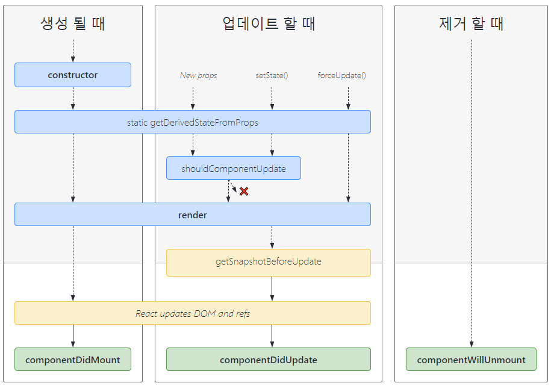
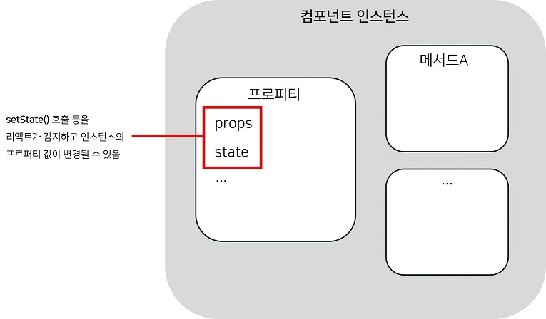
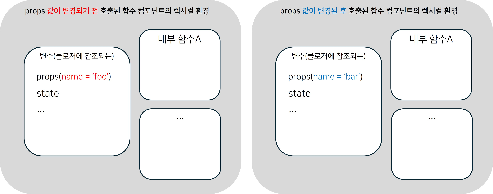

# 2.3 클래스 컴포넌트와 함수 컴포넌트

- [2.3 클래스 컴포넌트와 함수 컴포넌트](#23-클래스-컴포넌트와-함수-컴포넌트)
  - [2.3.1 클래스 컴포넌트](#231-클래스-컴포넌트)
    - [클래스 컴포넌트의 생명주기](#클래스-컴포넌트의-생명주기)
      - [생명주기 시점](#생명주기-시점)
      - [생명주기 메서드](#생명주기-메서드)
      - [에러 상황에서 실행되는 생명주기 메서드](#에러-상황에서-실행되는-생명주기-메서드)
    - [클래스 컴포넌트의 한계](#클래스-컴포넌트의-한계)
  - [2.3.2 함수 컴포넌트](#232-함수-컴포넌트)
  - [2.3.3 함수 컴포넌트 vs. 클래스 컴포넌트](#233-함수-컴포넌트-vs-클래스-컴포넌트)
    - [함수 컴포넌트는 생명주기가 없다](#함수-컴포넌트는-생명주기가-없다)
    - [클래스 컴포넌트는 랜더링된 값을 고정하지 못한다](#클래스-컴포넌트는-랜더링된-값을-고정하지-못한다)
      - [클래스 컴포넌트의 작동 방식](#클래스-컴포넌트의-작동-방식)
      - [함수 컴포넌트의 작동 방식](#함수-컴포넌트의-작동-방식)

<br><br>

이전에는 클래스 컴포넌트가 사용되다가 리액트 16.8 버전에서 **훅(Hook)** 이 소개된 이후로 함수 컴포넌트가 주로 사용되고 있다.

함수 컴포넌트는 훅이 소개된 16.8버전에서 새로 추가된 기능이 아니고,리액트 0.14 버전부터 존재하는 기능이었다. 하지만 그 당시의 함수 컴포넌트는 **무상태 컴포넌트**를 렌더링하는 목적으로만 사용되었다.

```jsx
const Component = (props) => {
  return <ChildComponent>text</ChildComponent>;
};
```

<br>

다양한 이유에 의해 이제 함수 컴포넌트를 사용하도록 권장되고 있지만, 기존 클래스 컴포넌트로 작성된 코드의 유지보수와 에러 처리를 위한 클래스 컴포넌트 사용 등을 위해 클래스 컴포넌트를 학습할 필요가 있다.

<br><br><br>

## 2.3.1 클래스 컴포넌트

```jsx
// 클래스 컴포넌트의 기본 형태
class Welcome extends React.Component {
  render() {
    return <h1>Hello, {this.props.name}</h1>;
  }
}
```

<br>

### 클래스 컴포넌트의 생명주기

함수 컴포넌트에서는 생명주기가 존재하지 않지만 클래스 컴포넌트에서는 많은 코드들이 생명주기 메서드에 의존하고 있다.

#### 생명주기 시점

생명주기 시점은 크게 3가지로 볼 수 있다.

- **마운트(mount)**: 컴포넌트가 생성(마운트) 되는 시점
- **업데이트(update)**: 컴포넌트의 내용이 변경되는 시점
- **언마운트(unmount)**: 컴포넌트가 더이상 존재하지 않는 시점

<br>

#### 생명주기 메서드



생명주기 메서드는 위의 다이어그램과 같이 나누어져 있다.

- **render**: UI 렌더링만을 위해 사용되고, 메서드 내부에서 값을 변경하면 안된다.
- **componentDidMount**: 컴포넌트가 마운트 되고 나면 실행된다.
- **componentDidUpdate**: 컴포넌트가 업데이트 되고 나면 실행된다.
- **componentWillUnmount**: 컴포넌트가 언마운트되거나 그 직전에 실행된다.
- **shouldComponentUpdate**: 이 메서드의 return값이 true인 경우에만 컴포넌트를 업데이트(리렌더링) 한다.

  ```jsx
  shouldComponentUpdate(nextProps, nextStates) {
    // props의 title값이 변하지 않으면 컴포넌트를 리렌더링 하지 않는다.
    // 이는 기존의 컴포넌트를 사용하여 성능을 최적화하는 메모이제이션 방법이다.
    return this.props.title !== nextProps.title
  };
  ```

  📌클래스 컴포넌트에는 `Component`와 `PureComponent`가 있는데, `PureComponent`는 `shouldComponentUpdate` 메서드에서 얕은 비교 로직이 있어 값이 같을 때에는 리렌더링을 하지 않도록 내부 로직이 구현되어있다.

- **getDerivedStateFromProps**: `render()` 이전에 실행되고, return값이 state로 들어간다. 변경되는 props를 바탕으로 state값을 변경시키고 싶을 때 사용된다.
- **getSnapShotBeforeUpdate**: DOM이 업데이트되기 이전에 실행되고, DOM 렌더링 이전에 윈도우 크기 조절, 스크롤 위치 변경과 같은 작업을 수행하기 위해 사용된다. return 값은 `componentDidUpdate()`의 세번째 인자로 접근 가능하다.

<br>

#### 에러 상황에서 실행되는 생명주기 메서드

- **getDerivedStateFromError**: 자식 컴포넌트에서 에러가 발생했을때 실행되고, return 값이 state로 들어간다. 주로 return값으로 추가한 state를 통해 자식 컴포넌트를 어떻게 렌더링할지 결정한다.
  ```jsx
  static getDerivedStateFromError(error) {
    return { hasError: true };
  }
  ```
- **componentDidCatch**: 자식 컴포넌트에서 에러가 발생했을때 실행 되는데, `getDerivedStateFromError`에서 에러가 잡히고 state가 결정되고 난 후에 실행된다.

  ```jsx
  // 어떤 컴포넌트가 에러를 발생시켰는지 정보가 나타나있는 `errorInfo`가 존재
  componentDidCatch(error, errorInfo) {
    console.log(error, errorInfo);
  }
  ```

<br>

📌`getSnapShotBeforeUpdate`, `getDerivedStateFromError`, `componentDidCatch` 메서드는 훅으로 구현되어 있지 않아 위 기능을 사용하려면 클래스 컴포넌트를 사용해야 한다.

<br><br>

### 클래스 컴포넌트의 한계

1. 데이터 흐름을 추적하기 어렵다.
   <br>
   ✔ 예를 들어, 생명주기 메서드인 `getDerivedStateFromProps()`는 `render()` 호출 직전에 호출되는데 return값이 state에 반영된다.(state의 흐름 추적이 어려움)
   <br>
   ✔ 생명주기 메서드는 생명주기 흐름에 따라 순서가 있는데, 개발자가 순서를 신경 안쓰고 메서드를 작성하면 코드를 읽기 어려움.
2. 내부로직 재사용이 어렵다.
   <br>
   ✔ 고차 컴포넌트로 감싸거나, props을 내리는 방식을 사용해야 되는데 공통 로직이 많아질수록 코드가 복잡해진다.
3. 생명주기를 많이 사용할수록 컴포넌트의 크기가 커진다.
4. JS의 특징으로 인해 다른 언어들과 다르게 동작하는 this, 비교적 늦게나온 클래스 개념으로 인해 JS개발자들에게 클래스 사용보다는 함수에 더 익숙하다.
5. 코드 크기 최적화하기 어렵다.
   <br>
   ✔ 클래스의 메서드는 트리 쉐이킹을 하지 않아 번들링 최적화가 어렵다.
6. 핫 리로딩에 불리하다.
   <br>
   ✔ 코드가 변경되면 클래스 컴포넌트의 상태값은 초기화 된다. 클래스 컴포넌트는 코드를 반영하려면 instance를 다시 만드는 방법밖에 없는 반면, 함수 컴포넌트는 클로저를 사용해 상태값을 기억하므로 함수가 다시 실행돼도 상태값을 기억한다.

<br><br><br>

## 2.3.2 함수 컴포넌트

```jsx
// 함수 컴포넌트의 기본 형태
function Counter() {
  const [count, setCount] = useState(0);

  function handleClick() {
    setCount(count + 1);
  }

  return <button onClick={handleClick}>You pressed me {count} times</button>;
}
```

클래스 컴포넌트와 다르게 코드도 간결하고, state도 객체가 아닌 각각의 원시값으로 관리할 수 있고 this를 사용하지 않아도 된다.

<br><br><br>

## 2.3.3 함수 컴포넌트 vs. 클래스 컴포넌트

### 함수 컴포넌트는 생명주기가 없다

대신 `useEffect`를 사용해서 `componentDidMount`, `componentDidUpdate`, `componentWillUnmount`생명주기 메서드를 비슷하게 구현할 수 있다.

<br>

### 클래스 컴포넌트는 랜더링된 값을 고정하지 못한다

아래 함수 컴포넌트와 클래스 컴포넌트의 예시는

- props.name의 기존 값은 `'foo'`
- 버튼이 클릭되고 3초가 되기 전에 props.name의 값은 `'bar'`로 변경됨

위의 두가지 조건을 전제로 한다.

```jsx
// 함수 컴포넌트 예제
function FunctionComponent(props) {
  const handleClick = () => {
    setTimeout(() => {
      console.log(props.name); // output: 'foo'
    }, 3000);
  };

  return <button onClick={handleClick}>3초 후 이름 확인하기</button>;
}
```

<br>

```jsx
// 클래스 컴포넌트 예제
class ClassComponent extends React.Component {
  handleClick = () => {
    setTimeout(() => {
      console.log(this.props.name); // output: 'bar'
    }, 3000);
  };

  render() {
    return <button onClick={handleClick}>3초 후 이름 확인하기</button>;
  }
}
```

`함수 컴포넌트`는 개발자의 의도대로 `'foo'`가 출력되고 `클래스 컴포넌트`는 이와 다르게 `'bar'`가 출력됨을 알 수 있다.

<br>

#### 클래스 컴포넌트의 작동 방식



- 컴포넌트가 마운트(처음 생성)되면 인스턴스가 생성된다.
- 컴포넌트가 state, props값의 변경 등에 의해 리렌더링 되면 인스턴스가 render() 메서드를 호출 한다.
  (인스턴스는 리렌더링 될 때마다 새로 생성하지 않고, 마운트 시에 생성된 인스턴스를 계속 사용)
- 같은 인스턴스를 사용하기 때문에 부모 컴포넌트에 의해 props값이 변경되면 해당 인스턴스의 this.props도 값이 변하게 된다.
- 함수가 실행되는 시점의 this.props 값이 반영된다.

<br>

#### 함수 컴포넌트의 작동 방식



- 컴포넌트가 마운트(처음 생성) 될 때나 리렌더링 될 때 똑같이 함수 컴포넌트가 호출된다.
- 내부 함수가 호출 되어도, 그 내부 함수의 렉시컬 환경에 있는 변수를 참조하므로 props.name은 변경되기 이전의 원래 값이 반영된다.
