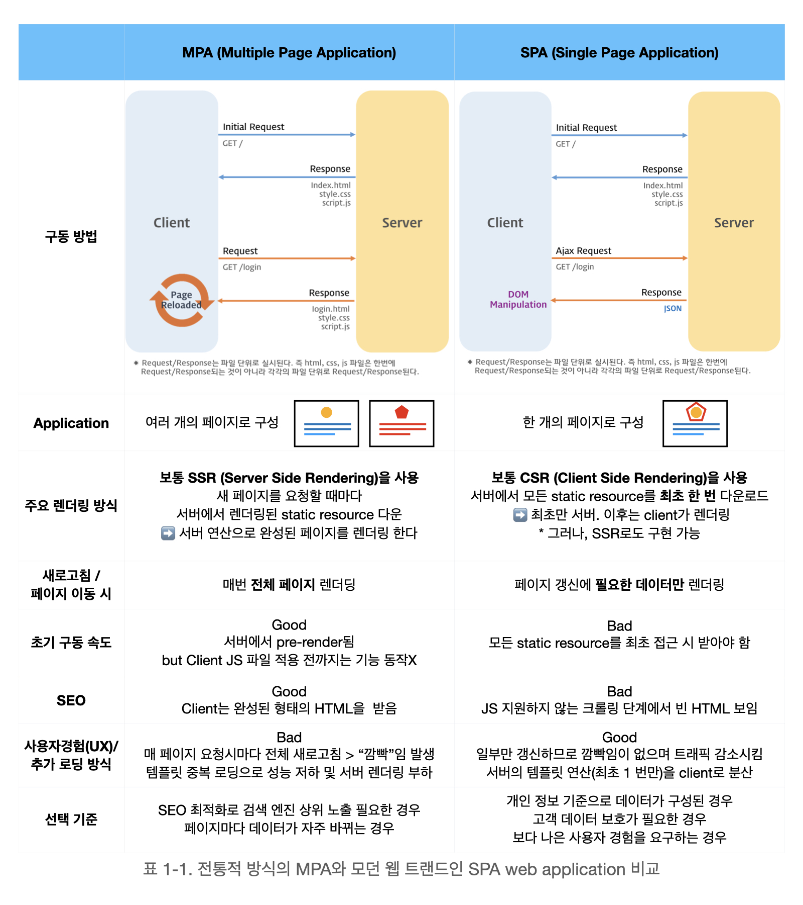

# 4.1 서버 사이드 렌더링이란?

- [4.1 서버 사이드 렌더링이란?](#41-서버-사이드-렌더링이란)
    - [SSR과 CSR](#ssr과-csr)
    - [MPA와 SPA](#mpa와-spa)
    - [현대의 SSR(Hybrid Rendering)](#현대의-ssrhybrid-rendering)
    - [Next.js의 렌더링 방식](#nextjs의-렌더링-방식)
    - [참고 자료](#참고-자료)

<br>

### SSR과 CSR

- **SSR**(Server Side Rendering): 서버 측에서 HTML을 렌더링해서 클라이언트측으로 전달하는 방식이다.
  <br>
  ✔ _초기 페이지 로딩 속도가 빠르고 SEO에 유리하다는 등의 장점이 있다._
- **CSR**(Client Side Rendering): 클라이언트(브라우저)에서 JavaScript를 사용하여 HTML을 동적으로 생성하고 렌더링하는 방식이다.

<br>

### MPA와 SPA

- **MPA**(Multi Page Application): 페이지 이동시마다 서버측에서 HTML을 렌더링해서 클라이언트측으로 전달한다.
  <br>
  ✔ _MPA는 주로 SSR 방식으로 구현되지만, 일부 동적 기능에 CSR을 사용할 수도 있다._
- **SPA**(Single Page Application): 페이지의 초기 로딩 시 서버로부터 최소한의 HTML을 받아오고, 그 이후의 페이지 이동 등의 작업은 클라이언트(브라우저)에서 JavaScript를 통해 이루어진다.
  <br>
  ✔ _주로 CSR 방식으로 구현되지만, SSR을 적용해서 초기 로딩 성능을 개선하고 SEO 문제를 해결할 수도 있다._

<br>

아래의 그림을 통해 전통적인 MPA와 최근 각광받는 SPA을 비교해서 볼 수 있다.



<br>

### 현대의 SSR(Hybrid Rendering)

SPA에 SSR 방식을 적용해서 초기 로딩 성능을 개선하고 SEO 문제를 해결한 렌더링 방식이다. 처음 렌더링 이후로는 CSR 방식으로 작동한다.

<br>

### Next.js의 렌더링 방식

Next.js는 SSR, CSR 등 다양한 렌더링 방식을 지원한다. 따라서 Next.js를 이용하면 Hybrid Rendering을 구현할 수 있다.

```tsx
// pages/a.js에 구현된 렌더링 코드로, "/a" url 접근시 해당 코드를 토대로 페이지를 렌더링함

export default function PageA({ data }) {
  return (
    <div>
      <h1>Page A</h1>
      <Link href="/b">
        <a>Go to Page B</a>
      </Link>
    </div>
  );
}
```

- “/a” url에 접근하면 위의 코드를 토대로 SSR로 HTML을 렌더링 한다.
- Next.js에서 제공하는 `Link` 태그를 이용하면 CSR로 작동한다. 반면 `a` 태그를 이용하면 새로운 페이지로 이동하기 때문에 SSR로 작동한다.

<br>

### 참고 자료

- [개인 블로그 Quartz.log - MPA와 SPA의 비교 사진 참고](https://velog.io/@skyu_dev/NextJS)
