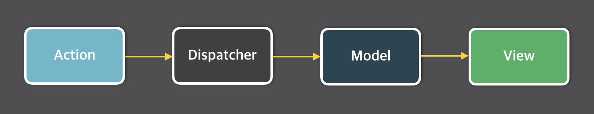
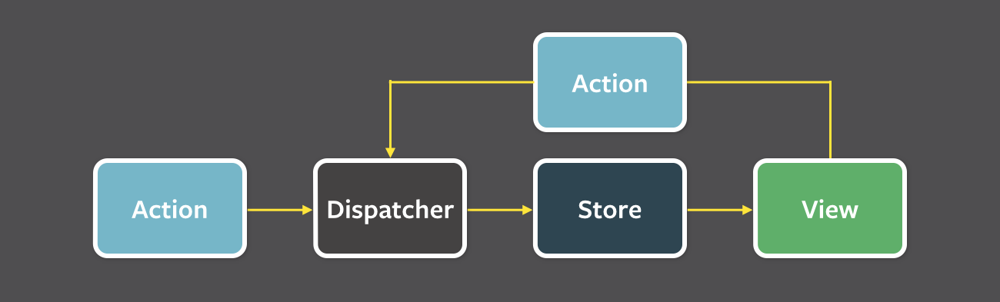

# 5.1 상태 관리는 왜 필요한가?

개발에서의 상태: 의미를 지닌 값, 앱의 시나리오에 따라 지속적으로 변경될 수 있는 값

웹 애플리케이션에서 상태로 분류될 수 있는 것들

1. UI : 상호 작용이 가능한 모든 요소의 현재 값
2. URL: 브라우저에서 관리되고 있는 상태값, 라우팅에 따라 상태가 변화한다
3. 폼: 로딩중인지, 제출됐는지, 접근 불가한지, 값이 유효한지, 모두 상태로 관리됨
4. 서버에서 가져온 값: API요청으로 가지고 온 값

상태에 따라 맞는 UI를 보여줘야 한다.  
상태를 어디에 두고, 어떻게 변화를 감지하고, 어떻게 관리할 것인가?

## 5.1.1 리액트 상태 관리의 역사

### Flux 패턴의 등장





- 액션: 작업을 처리할 액션, 액션 발생 시에 포함시킬 데이터
- 디스패처: 액션을 스토어로 보내는 역할, 액션 타입과 데이터를 모두 스토어로 보냄
- 스토어: 실제 상태에 따른 값과 상태를 변경할 수 있는 메서드를 가지고 있음
- 뷰: 리액트의 컴포넌트에 해당 함

페이스북 팀에서 양방향이 아닌 데이터 추적하기 쉬운 단방향 데이터 흐름을 제안함

```tsx
//코드 예시
import { useReducer } from "react";
import AddTask from "./AddTask.js";
import TaskList from "./TaskList.js";

export default function TaskApp() {
  const [tasks, dispatch] = useReducer(tasksReducer, initialTasks);

  function handleAddTask(text) {
    dispatch({
      type: "added",
      id: nextId++,
      text: text,
    });
  }

  function handleChangeTask(task) {
    dispatch({
      type: "changed",
      task: task,
    });
  }

  function handleDeleteTask(taskId) {
    dispatch({
      type: "deleted",
      id: taskId,
    });
  }

  return (
    <>
      <h1>Day off in Kyoto</h1>
      <AddTask onAddTask={handleAddTask} />
      <TaskList
        tasks={tasks}
        onChangeTask={handleChangeTask}
        onDeleteTask={handleDeleteTask}
      />
    </>
  );
}

function tasksReducer(tasks, action) {
  switch (action.type) {
    case "added": {
      return [
        ...tasks,
        {
          id: action.id,
          text: action.text,
          done: false,
        },
      ];
    }
    case "changed": {
      return tasks.map((t) => {
        if (t.id === action.task.id) {
          return action.task;
        } else {
          return t;
        }
      });
    }
    case "deleted": {
      return tasks.filter((t) => t.id !== action.id);
    }
    default: {
      throw Error("Unknown action: " + action.type);
    }
  }
}

let nextId = 3;
const initialTasks = [
  { id: 0, text: "Philosopher’s Path", done: true },
  { id: 1, text: "Visit the temple", done: false },
  { id: 2, text: "Drink matcha", done: false },
];
```

### 리덕스

리덕스는 Flux구조에 Elm 아키텍처를 도입한 상태 관리 라이브러리이다.  
Elm은 데이터 흐름을 모델, 뷰, 업데이트 3가지로 분류한다.
리덕스는 이러한 아키텍처에 영향을 받아서 작성됐다.

1. 하나의 상태 객체를 스토어에 저장
2. 객체를 업데이트 하는 작업을 디스패치
3. 상태 업데이트

### Context API와 useContext

Context API를 사용하면 props drilling을 줄일 수 있다.
하지만 Context API는 상태 관리가 아닌 상태 주입을 도와주는 도구라고 보는게 좋다.
구체적인 이야기는 3.1절에서 설명한다.

### React Query, SWR

HTTP 요청에 특화된 상태 관리 라이브러리,
API요청에 대한 응답값을 키값을 가지고 캐싱하고 있다.
동일한 키로 호출이 되면 API 요청이 아닌 캐시된 값을 활용한다.

### Recoil, Zustand, Jotai, Valtio

최근 떠오르는 상태 관리 라이브러리들은 훅을 활용해서 작은 크기의 상태를 효율적으로 관리한다.

```tsx

//Recoil
const counter = atom({key:'count', default:0});
const todoList = useRecoilValue(counter);

//Jotai
const countAtom = atom(0);
const [count, setCount]=useAtom(countAtom);


//Zustand
const useCounterStore = create((set)=>{
  count:0,
  increace:()=>set((state)=>({count:state.count + 1})),
});

//Valtio
const state = proxy({count:0});
const snap = useSnapshot(state);
state.count++;

```
