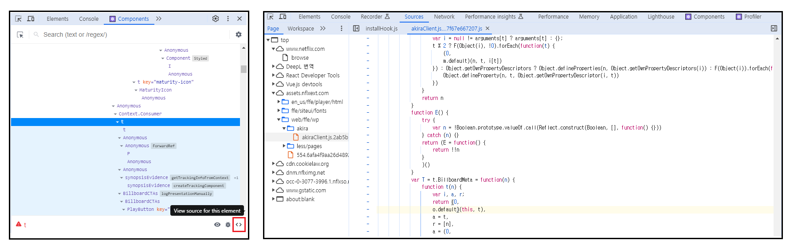

# 6. 리액트 개발 도구로 디버깅하기

- [6. 리액트 개발 도구로 디버깅하기](#6-리액트-개발-도구로-디버깅하기)
  - [리액트 개발 도구란?](#리액트-개발-도구란)
  - [Components 탭](#components-탭)
    - [1. 컴포넌트의 트리 구조를 확인할 수 있다.](#1-컴포넌트의-트리-구조를-확인할-수-있다)
    - [2. 각 컴포넌트의 props 정보, 사용되고 있는 Hooks을 확인할 수 있다.](#2-각-컴포넌트의-props-정보-사용되고-있는-hooks을-확인할-수-있다)
    - [3. 어떤 컴포넌트에 의해 렌더링 됐는지(rendered by)를 알 수 있다.](#3-어떤-컴포넌트에-의해-렌더링-됐는지rendered-by를-알-수-있다)
    - [4. 익명 함수로 선언된 컴포넌트는 개발툴에서 `Anonymous`와 같이 보여지기 때문에 디버깅이 어려워진다.](#4-익명-함수로-선언된-컴포넌트는-개발툴에서-anonymous와-같이-보여지기-때문에-디버깅이-어려워진다)
    - [5. 첫 번째 눈 아이콘을 클릭하면, 현재 Components 탭에서 포커싱 되어있는 컴포넌트를 Elements 탭에서 확인할 수 있다.](#5-첫-번째-눈-아이콘을-클릭하면-현재-components-탭에서-포커싱-되어있는-컴포넌트를-elements-탭에서-확인할-수-있다)
    - [6. 두 번째 벌레 아이콘을 클릭하면, 현재 Components 탭에서 포커싱 되어있는 컴포넌트의 props와 hook 정보를 Console 탭에서 확인할 수 있다.](#6-두-번째-벌레-아이콘을-클릭하면-현재-components-탭에서-포커싱-되어있는-컴포넌트의-props와-hook-정보를-console-탭에서-확인할-수-있다)
    - [7. 세 번째 소스코드 아이콘을 클릭하면, 빌드된 실제 자바스크립트 소스코드를 Sources 탭에서 확인할 수 있다.](#7-세-번째-소스코드-아이콘을-클릭하면-빌드된-실제-자바스크립트-소스코드를-sources-탭에서-확인할-수-있다)
  - [Profiler 탭](#profiler-탭)
    - [Profiler 추가하면 좋은 설정](#profiler-추가하면-좋은-설정)
    - [프로파일링 주요 기능](#프로파일링-주요-기능)
    - [프로파일링 과정](#프로파일링-과정)

<br>

## 리액트 개발 도구란?

리액트 애플리케이션을 디버깅 하기 위해 만들어졌고,
여러가지 방법중 브라우저 확장 프로그램을 설치하면 쉽게 개발툴을 사용할 수 있다.

<br>


빌드된 리액트 페이지(프로덕션 모드)에 접근하면 **파란색으로 활성화**된 아이콘을 볼 수 있고, 로컬에서 실행한 개발 모드 페이지는 **붉은색 활성화**된 아이콘을 볼 수 있다.

<br>


위와 같이 **Components**와 **Profiler** 탭을 통해 리액트 앱을 디버깅 할 수 있다.

<br><br><br>

## Components 탭

Components 탭을 이용해서 리액트 컴포넌트 트리의 내용을 디버깅 할 수 있다.

<br>

### 1. 컴포넌트의 트리 구조를 확인할 수 있다.

```tsx
// 앞으로 모든 예시코드는 Next.js에서 작성 되었다.

function Component1() {
  return <div>Component1</div>;
}

function Component2() {
  return <div>Component2</div>;
}

function Component3() {
  return <div>Component3</div>;
}

export default function Home() {
  return (
    <main>
      <Component1 />
      <Component2 />
      <Component3 />
    </main>
  );
}
```

위처럼 컴포넌트를 작성했을 때 아래와 같은 컴포넌트 트리를 개발툴에서 확인할 수 있다.


<br>

### 2. 각 컴포넌트의 props 정보, 사용되고 있는 Hooks을 확인할 수 있다.


리액트 공식문서 페이지의 헤더 부분에서 `section`이라는 prop은 `"learn"`을, `useState()`를 사용한 첫번째 훅은 `false`값을 가지고 있는것을 확인할 수 있다.

<br>


그리고 prop의 함수를 우클릭 한 후에 `Go to definition`을 클릭하면 위와 같이 Sources 탭에서 빌드된 코드를 확인할 수 있다.

<br>

### 3. 어떤 컴포넌트에 의해 렌더링 됐는지(rendered by)를 알 수 있다.


`Component1`은 **Home -> App -> HydrateRoot() -> react-dom**과 같이 렌더링된 구조를 확인할 수 있다. 단, 프로덕션 모드에서는 react-dom만 보이고 개발 모드에서만 세부적인 렌더링 구조를 확인할 수 있다.

<br>

### 4. 익명 함수로 선언된 컴포넌트는 개발툴에서 `Anonymous`와 같이 보여지기 때문에 디버깅이 어려워진다.

```tsx
const MemoizedComponent = memo(() => {
  return <div>메모 컴포넌트</div>;
});
```

위의 컴포넌트는 개발툴에서 `Anonymous`로 보여 디버깅하기에 어렵다. 하지만 `MemoizedComponent.displayName = '메모 컴포넌트'`과 같이 `displayName`을 이용하면 익명 함수도 개발툴에서 컴포넌트명을 확인할 수 있다.

```tsx
// ❌
useEffect(() => {
  console.log("use Effect");
});

// ✔
useEffect(function logger() {
  console.log("use Effect");
});
```

Hook도 마찬가지로, 기명 함수로 값을 넘겨주면 `f () {}`보다 상세한 `f logger() {}`을 개발툴에서 볼 수 있다.

<br>

### 5. 첫 번째 눈 아이콘을 클릭하면, 현재 Components 탭에서 포커싱 되어있는 컴포넌트를 Elements 탭에서 확인할 수 있다.


눈 아이콘을 클릭하면 우측 사진과 같이 Elements 탭으로 이동한다.

<br>

### 6. 두 번째 벌레 아이콘을 클릭하면, 현재 Components 탭에서 포커싱 되어있는 컴포넌트의 props와 hook 정보를 Console 탭에서 확인할 수 있다.


<br>

### 7. 세 번째 소스코드 아이콘을 클릭하면, 빌드된 실제 자바스크립트 소스코드를 Sources 탭에서 확인할 수 있다.



<br><br><br>

## Profiler 탭

Profiler 탭을 이용하면 어떤 컴포넌트가 렌더링 됐는지, 몇 번 렌더링 됐는지,
렌더링 되는데 몇 초가 걸렸는지 등 렌더링 과정에서 발생하는 상황을 확인할 수 있다. 단, 프로덕션 모드에서는 불가능하고 개발 모드에서만 Profiler 탭을 이용할 수 있다.

<br>

### Profiler 추가하면 좋은 설정

- `General` - `Highlight updates when components render.` 옵션 체크
  <br>
  (렌더링 되는 컴포넌트가 UI 상에서 강조됨)
- `Profiler` - `Record why each component rendered while profiling.` 옵션 체크
  <br>
  (해당 컴포넌트가 렌더링 된 이유를 Profiler 탭에서 확인할 수 있음)

<br>

### 프로파일링 주요 기능


- **파란색 버튼**: 프로파일링 시작 버튼으로, 버튼을 누르면 프로파일링이 시작되고, 프로파일링을 종료하려면 붉은색으로 변한 버튼을 누르면 된다.
- **새로고침 버튼**: 페이지를 새로고침하는 동시에 프로파일링을 시작시키는 버튼이다. 마찬가지로 프로파일링을 종료하려면 붉은 버튼을 눌러야 한다.
- **Flamegraph 탭**: 컴포넌트의 렌더링 정보, 원인, 소요 시간 등이 나타나 있다.
- **Ranked 탭**: 렌더링 소요 시간 순으로 컴포넌트가 나열되어 있다.
- **Timeline 탭**: 타임라인 순으로 컴포넌트에 어떤일이 일어났는지를 확인할 수 있다.
  <br>
  (ex. 3초에 `count` state가 업데이트됨)

<br>

### 프로파일링 과정

```tsx
// HelloWorld 컴포넌트
function HelloWorldComponent({ name }) {
  return <div>Hello World!, {name}</div>;
}

// 카운터 컴포넌트
function CounterComponent({ count, onClickButton }) {
  return (
    <div>
      <div>count: {count}</div>
      <button onClick={onClickButton}>+</button>
      <HelloWorldComponent name={"eunchae"} />
    </div>
  );
}

// 구현부
export default function Home() {
  const [count, setCount] = useState(0);

  const Increment = () => {
    setCount((prev) => prev + 1);
  };

  return (
    <main>
      <CounterComponent count={count} onClickButton={Increment} />
    </main>
  );
}
```


해당 코드의 UI와 렌더링 과정 프로파일은 위와 같다. 이 상태에서 프로파일링 버튼을 누른 후에 `+` 버튼을 누른 후에 프로파일링 중지 버튼을 눌러보자

<br>


Profiler의 `Home` 위에 마우스를 올리면 `Why did this render?`와 같이 렌더링 된 이유를 확인할 수 있다. Components 탭에서 Home 컴포넌트의 첫번째 훅의 `State: 1` 을 보고 개발자는 `Home` 컴포넌트가 왜 렌더링 됐는지 원인을 분석할 수 있을 것이다.

<br>

그리고 기존의 코드는 `HelloWorldComponent`가 불필요하게 리렌더링 되는것 또한 Profiler를 통해 알 수 있었으므로 `memo` 컴포넌트를 이용해서 렌더링 최적화 작업을 할 수 있다.


```tsx
// 기존 코드
function HelloWorldComponent({ name }) {
  return <div>Hello World!, {name}</div>;
}

// 렌더링 최적화 코드
const HelloWorldComponent = memo(function HelloWorldComponent({ name }) {
  return <div>Hello World!, {name}</div>;
});
```
