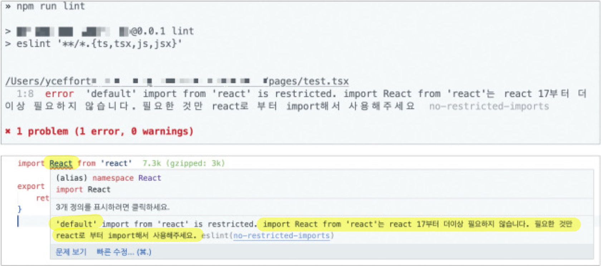
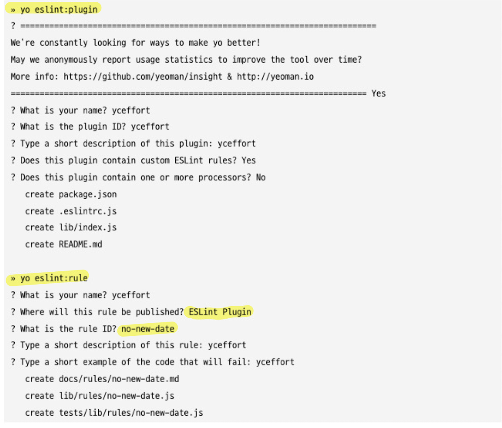
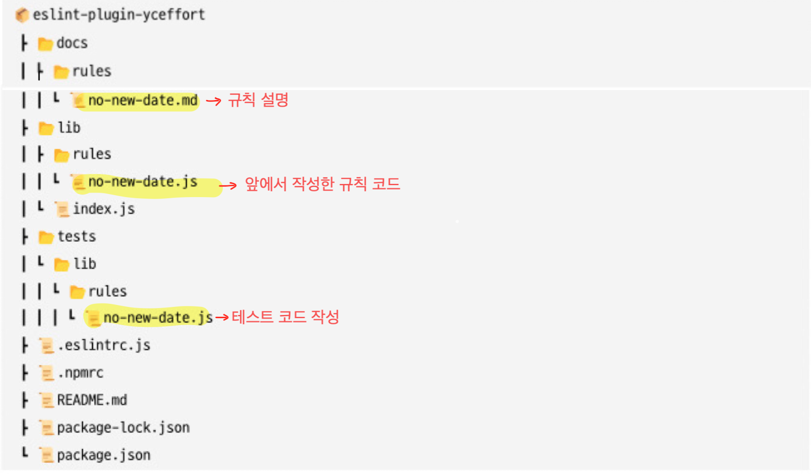

# 8장. 좋은 리액트 코드 작성을 위환 환경 구축하기

## 8.1. ESLint를 활용한 정적 코드 분석

- **정적 코드 분석** : 코드의 실행과는 별개로 코드 그 자체만으로 코드 스멜(잠재적으로 버그를 야기할 수 있는 코드)을 찾아내서 문제의 소지가 있는 코드를 사전에 수정하는 것
- **ESLint** : JS 생태계에서 가장 많이 사용되는 정적 코드 분석 도구

### 8.1.1. ESLint 살펴보기

- ESLint는 어떻게 코드를 분석할까?
    1. **JS 코드를 “문자열”로 읽는다**
    2. **JS 코드를 분석할 수 있는 parser로 코드를 구조화 한다.**
    3. **2번에서 구조화한 트리를 AST라고 하며, 이 트리를 기준으로 각종 규칙과 대조한다.**
    4. **규칙과 대조했을 때, 규칙을 위반한 코드를 알리거나(report) 수정한다(fix)**

### ⭐️ ESLint를 위한 파서 **espree**

- 변수인지, 함수인지, 함수명은 무엇인지 파악
- 코드의 정확한 위치와 같은 아주 세세한 정보도 파악
    
    → ESLint 같은 정적 코드 분석기가 코드의 줄바꿈, 들여쓰기 등을 파악할 수 있게하기 위해
    
- AST explore : 파서의 기능을 웹사이트에서 사용해 볼 수 있다.
- ESLint의 “규칙”과 규칙들을 모아놓은 “plugin”

### **▶️ 프로덕션 모드에서 debugger 모드 사용 금지 규칙 예시**

- debugger만을 espree로 분석한 코드
    
    ```tsx
    {
    	"type": "Program",
    	"body": [
    		{
    			"type": "DebuggerStatement",
    			"range": [0, 8]
    		}
    	],
    	"sourceType": "module",
    	"range": [0, 8]
    }
    ```
    
- ESLint의 no-debugger 규칙 코드
    
    ```tsx
    module.exports = {
    	meta: {
    		type: 'problem',
    		docs: {
    			description: 'Disallow the use of "debugger"',
    			recommended: true,
    			url: 'https://eslint.org/docs/rules/no-debugger',
    		},
    		fixable: null,
    		schema: [],
    		messages: {
    			unexpected: "Unexpected 'debugger' statement."
    		},
    	},
    		create(context) {
    			return {
    				DebuggerStatement(node) {
    					context.report({
    						node,
    						messageId: 'unexpected'
    					}),
    				},
    			}
    		},
    	}
    
    ```
    
    - meta : 규칙과 관련된 데이터
    - messages : 규칙을 어겼을때 반환하는 경고 문구
    - docs : 문서화에 필요한 데이터
    - fixable : 코드가 수정 가능한지 여부
    - create : 실제로 코드에서 문제를 확인하는 곳
        - DebuggerStatement() 함수이름이 debugger를 espree로 분석한 코드의 type과 같다.

---

### 8.1.2. eslint-plugin과 eslint-config

### **⭐️ eslint-plugin**

- 특정 프레임워크나 도메인과 관련된 규칙을 묶어서 제공하는 패키지
- **eslint-plugin-react**

### **⭐️ eslint-config**

- eslint-plugin을 한데 묶어서 완벽하게 한 세트로 제공하는 패키지
- 여러 프로젝트에 걸쳐 동일하게 사용할 수 있는 ESLint 관련 설정을 제공하는 패키지
- eslint-plugin과 eslint-config **네이밍 규칙**
    1. eslint-plugin과 eslint-config 접두사를 준수한다.
    2. 접두사 뒤에 오는 단어는 반드시 한 단어!
    3. 특정 스코프가 앞에 붙는 것 까지는 가능하다

> 💡 **하지만 개인이 만드는 일은 드물며, 일부 IT 기업들에서 잘 만들어진 eslint-config를 빠르게 적용하여 사용하는 것이 일반적이다.**

- 대표적인 eslint-config를 알아보자
    - **eslint-config-airbnb**
        - 에어비앤비에서 만들었다.
        - **리액트 기반 프로젝트에서 가장 먼저 손꼽힌다.**
    - **@titicaca/triple-config-kit**
        - 스타트업 개발사 인터파크트리플에서 만들었다.
        - **자체적으로 정의한 규칙 기반으로 운영된다.**
            - 대부분의 eslint-config는 eslint-config-airbnb를 기반으로 만들어진다.
        - 외부로 제공하는 규칙에 대한 테스트 코드가 존재한다.
            - 일반적인 npm 라이브러리 구축 및 관리를 위한 시스템이 잘 구축돼 있다.
        - eslint-config 구축에 관심이 있다면 도움이 된다.
    - **eslint-confing-next**
        - 단순히 JS 코드를 정적으로 분석할 뿐만 아니라 페이지나 컴포넌트에서 반환하는 JSX 구문 및
            
            _app, _document에서 작성돼 있는 HTML 코드 또한 정적 분석 대상으로 분류해 제공
            

---

### 8.1.3. 나만의 ESLint 규칙 만들기

- 조직 내부의 규칙 또는 코드의 변화로 일괄 수정이 필요한 경우가 있다.
    
    사람이 일일이 바꾸기에는 비효율적이며 실수가능성도 있다.
    
- 이때 나만의 ESLint 규칙을 활용할 수 있다.

### **1️⃣ 이미 존재하는 규칙을 커스터마이징해서 적용하기 (import React 제거 규칙)**

- 이유 : import React를 제거함으로서 WEB-PACK의 트리쉐이킹 속도 향상 가능
- 활용할 기존 규칙 : no-restricted-imports
    - 추가적으로 인수를 제공하면 특정 모듈을 import하는 것을 금지한다.
- 나만의 ESLint 규칙 코드
    
    ```tsx
    module.exports = {
    	rules: {
    		'no-restricted-imports': [
    			'error',
    			{
    				// paths에 금지시킬 모듈을 추가한다.
    				paths: [
    					{
    					// 모듈명
    					name:
    					' react',
    					// 모듈의 이름
    					importNames: ['default'],
    					// 경고 메시지
    					message:
    						"import React from 'react'는 react 17부터 더 이상 필요하지 않습니다. 필요한 것만 react
    						로부터 import해서 사용해 주세요.",
    					},
    				],
    			},
    		],
    	},
    }
    ```
    
    - “import React“ 만을 필터링하기 위해 [default export] 만 금지한다.
- 필터링 결과
    
    

### **2️⃣ 완전히  새로운 규칙 만들기 (new Date 금지 규칙)**

- 규칙이 필요한 상황 가정 : 실제 한국 시간을 서버에서 반환하는 ServerDate()만을 사용하도록 한다는 상황
    - 기기에 의존적인 new Date() 함수 사용 금지
    - JS의 Date 객체를 활용해 특정 시간을 가져오기 위한 것은 예외처리하여 사용해야 함
        - new Date(1664608053676)이나 new Date(’2022-01-01’) 함수
- espree 파서를 통해 만들어진 new Date()의 AST 코드
    
    ```tsx
    {
    	"type": "Program",
    	"start": 0,
    	"end": 10,
    	"range": [0, 10],
    	"body": [
    		{
    			"type": "ExpressionStatement"
    			"start": 0,
    			"end": 10,
    			"range": [0, 10],
    			"expression": { // 중요
    				"type": "NewExpression" // 타입
    				"start": 0,
    				"end": 10,
    				"range": [0, 10],
    				"callee": {
    					"type": "Identifier"
    					"start": 4,
    					"end": 8,
    					"range": [4, 8],
    					"name": "Date" // 이름
    					},
    					"arguments": [] // 생성자에 전달하는 인수
    				}
    			}
    		],
    		"sourceType" : "module"
    	}
    ```
    
    - new Date()함수를 금지시키기 위해 눈여겨 봐야 할 코드
        - ExpressionStatement.expression : ESLint가  확인하는 하나의 노드 단위
        - ExpressionStatement.expression.type : NewExpression
        - ExpressionStatement.expression.callee : Date
        - ExpressionStatement.expression.arguments : 인수가 없음
    - new Date() AST의 정보를 가지고 만든 ESLint 규칙 코드
        
        ```tsx
        /**
        	* @type (import('eslint').Rule.RuleModule}
        	*/
        module.exports = {
        	meta: {
        		type: 'suggestion'.
        		docs: {
        			description: 'disallow use of the new Date()',
        			recommended: false,
        		},
        		fixable: 'code',
        		schema: [],
        		messages: {
        			message : 'new Date()는 클라이언트에서 실행 시 해당 기기의 시간에 의존적이라 
        			정확하지 않습니다. 현재 시간이 필요하다면 ServerDate()를 사용해 주세요.',
        		},
        	},
        	create: function (context) {
        		return {
        			NewExpression: function (node) {
        				if (node.callee.name === 'Date' && node.arguments.length === 0) {
        					context. report({
        						node: node,
        						messageld: 'message',
        						fix: function (fixer) {
        							return fixer.replaceText(node, 'ServerDate()')
        						},
        					})
        				}
        			},
        		}
        	},
        }
        ```
        
        - 실제로 new Date() AST 코드를 읽고 확인하는 create 함수를 확인해보자
            - NewExpression : new 생성자를 사용할 때 ESLint 실행되게 함
            - node.callee.name == ‘Date’ && node.arguments.length === 0 조건으로 사용
            - meta 데이터에 있는 message 값 사용
            - fix를 키로하는 함수로 **[ new Date() → ServerDate() ]** 자동 변경

### 3️⃣ 만든 규칙 배포하기

- 규칙을 하나씩 만들어 배포하는 것은 불가능
- 반드시 eslint-plugin 형태로 만들고, 규칙들을 묶음으로 배포해야 한다.
- eslint-plugin을 구성할 환경 세팅 :  yo와 generate-eslint를 활용
    
    
    
- 생성된 환경에서 코드 작성
    
    
    

### 8.1.4. 주의할 점

- ESLint를 활용하면 개발에 편리하지만, 반대로 ESLint를 잘못 설정하면 원치 않는 결과가 계속 발생하게된다

### 1️⃣ Prettier와의 충돌

- **Prettier : 코드를 정적 분석하여 줄바꿈, 들여쓰기, 작은따옴표, 큰따옴표 관리 등의 포매팅 도구**
- ESLint와 Prettier 모두 포매팅 기능을 가지고 있기에 이 과정에서 충돌 발생 가능
- **문제 해결 방법**
    1. 서로 충돌되지 않게끔 규칙을 잘 선언하는 것
    2. [ JS, TS ] 코드는 ESLint로 관리하고 그 외의 파일(md, YAML, JSON 등)은 Prettier에 맡긴다.
        - 서로 관여하는 파일을 물리적 분리
        - JS, TS에서 Prettier 기능이 필요하다면 eslint-plugin-prettier 사용

### 2️⃣ 규칙에 대한 예외 처리, 그리고 react-hooks/no-exhaustive-deps

```tsx
// eslint-disable-line no-exhaustive-deps
```

- **“의존성 배열이 완전하지 않다는 경고”를 무시하도록 하는 ESLint 주석**
- 대부분의 리액트 개발자가 위의 주석을 사용하는 경우 3가지
    1. 의존성 배열이 없어도 괜찮다고 임의로 판단하는 경우
        
        ❗️ 반대로 의존성 배열이 있어야 하는 곳에서 사용하게되면 버그를 야기할 수 있다.
        
    2. 의존성 배열이 너무 길어진 경우
        
        ❗️ useEffect 내부 함수가 길어진 것이기에 내부 함수를 쪼개서 가독성과 안정성 확보해야함
        
    3. 컴포넌트를 마운트 시점에 한 번만 실행하고 싶은 경우
        
        ❗️ 만약 state나 props가 변하게 된다면? → 빈 배열이기에 반응하지 못함
        
        ❗️ 정말 state나 props에 의존하지 않고 한 번만 실행되야 하는 함수라면 해당 컴포넌트가 아닌
             더욱 효율적인 로직으로 구현될 수 있다.
        

### 3️⃣ ESLint 버전 충돌

- 설치하려는 eslint-plugin과 eslint-config가 지원하는 ESLint 버전과 현재 프로젝트가 지원하는 ESLint 버전이 다르다면 eslint-plugin과 eslint-config는 사용할 수 없다.
- 항상 ESLint 버전을 확인하는 습관을 기르도록 하자.
- peerDependencies 명시
    
    "A 패키지"가 "B 패키지"의 특정 버전을 peerDependencies로 명시하는 package.json 파일 예시
    
    ```json
    {
      "name": "a-package",
      "version": "1.0.0",
      "peerDependencies": {
        "b-package": "^2.0.0"
    }
    ```
    
    - 위의 예시에서 "a-package"가 "b-package"의 버전 "^2.0.0"을 peerDependencies로 명시하고 있습니다. 이렇게 하면 "a-package"를 설치할 때, "b-package"의 버전이 2.0.0 이상이어야 함을 나타냅니다.
        
        그러면 npm이 "a-package"를 설치할 때 "b-package"의 2.0.0 이상 버전을 함께 설치하도록 보장합니다.
        

---

### 8.1.5. 정리

- npm으로 프로젝트를 시작한다면 무조건 ESLint를 설치하고 설정하는 것이 기본이다
- 프로젝트에서 eslint-config나 eslint-plugin이 사용되고 있다면 어떤 것인지, 왜 이 규칙을 사용하는지 한번씩 살펴보도록 하자.
- 이후에 ESLint가 익숙해진다면 본인만의 혹은 조직에서 사용할 eslint-config를 만들어보도록하자

> 👍 조직의 자바스크립트 코딩 철학을 eslint-config 하나로 소개할 수도 있을지 모른다