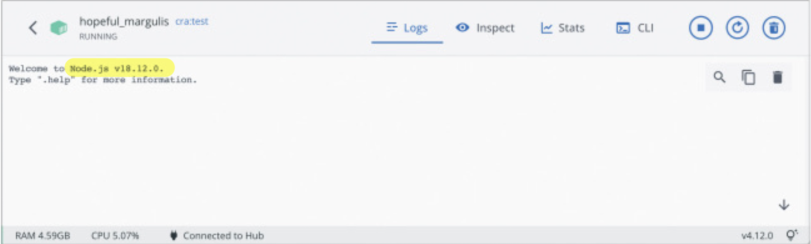
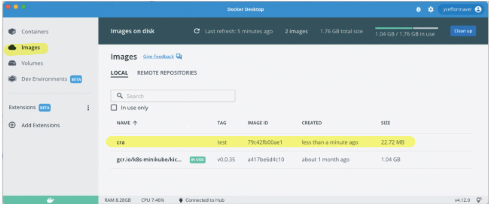
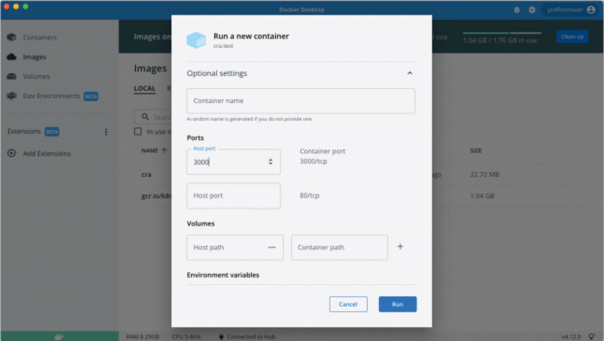
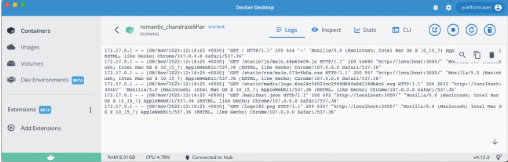
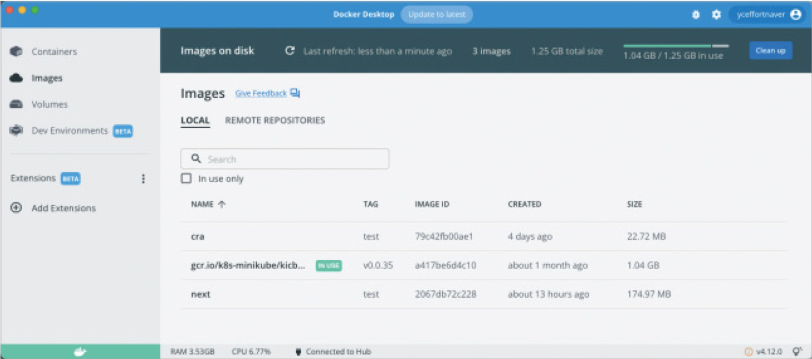
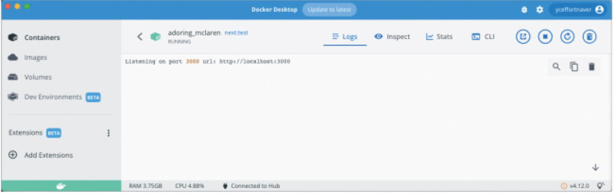

# 9장. 모던 리액트 개발 도구로 개발 및 배포 환경 구축하기

## 9.4. 리액트 애플리케이션 도커라이즈하기

- 과거 : 웹 애플리케이션 배포를 위해 직접 장비를 준비하고, 애플리케이션 구동에 필요한 각종 파일을 설치하고 소스를 다운로드하여 설치함
- 현재 : **“도커”** 를 이용하여 애플리케이션을 하나의 **“컨테이너”** 로 만들어서 빠르게 배포

### 9.4.1. 리액트 앱을 도커라이즈하는 방법

### ➡️ 도커라이즈란?

- 애플리케이션을 도커 이미지로 만드는 과정
- 애플리케이션을 신속하게 구축해 배포할 수 있는 상태로 준비하는 것.

### ➡️ 도커란?

- 개발자가 모던 애플리케이션을 구축, 공유, 실행하는 것을 도와줄 수 있도록 설계된 플랫폼이다. 도커는 지루한 설정 과정을 대신해 주므로 코드를 작성하는 일에만 집중할 수 있다.
- **지루한 설정 과정이란?**
    - 서버와 애플리케이션에 적절한 리소스 확보
    - 운영체제 설치
    - Node.js 설치 및 빌드
- **도커의 작동 방식**
    - 애플리케이션을 빠르게 배포할 수 있도록 애플리케이션을 “컨테이너” 단위로 패키징한다.
    - “컨테이너” 내부에서 애플리케이션이 실행될 수 있도록 한다.
    - 독립된 환경에서 애플리케이션이 항상 일관되게 실행할 수 있도록 보장해 준다.

### ➡️ 도커 용어

- **이미지** : 컨테이너를 만드는 데 사용되는 템플릿 (Dockerfile이 필요하다)
- **컨테이너** : 도커의 이미지를 실행한 상태.
    - 컨테이너 안에서 운영체제, 파일시스템, 각종 자원 및 네트워크 등이 할당되어 실행될 수 있는 독립접 공간
- **Dockerfile** : 어떤 이미지 파일을 만들지 정의하는 파일
- **태그** : 이미지를 식별할 수 있는 레이블 값 ([ ”이름” : “태그명” ] 형태)
- **리포지터리** : 이미지를 모아두는 장소
- **레지스트리** : 리포지터리에 접근할 수 있게 해주는 서비스 (도커 허브)

### ➡️ 자주 쓰는 도커 CLI 명령어

- **docker build** : Dockerfile을 기준으로 이미지를 빌드하는 작업
    - `docker build -t foo:bar ./`
- **docker push** : 이미지나 리포지터리를 토커 레지스트리에 업로드하는 과정
    - `docker push yceffort/foo:bar`
- **docker tag** : 이미지에 태그를 생성하는 명령어
    - `docer tag “원본이미지:태그” “변경할이미지:태그”`
    - 이름을 수정하는게 아니라 기존 이미지에 새로운 태그를 붙이는 것.
- **docker inspect** : 이미지나 컨테이너의 세부 정보 출력
- **docker run** : 이미지를 기반으로 새로운 컨테이너를 생성하는 명령어
- **docker ps** : 현재 가동 중인 컨테이너 목록을 확인
- **docker rm** : 컨테이너 삭제
    - `docker rm “삭제할 이미지 명”`
- **docker —version** : 도커 데스크톱 프로그램이 정상 작동하는 지 확인

---

### ➡️ create-react-app을 위한 Dockerfile 작성하기

- 프런트엔드 애플리케이션이 도커 이미지에서 해야 할 작업
    1. **운영체제 설정** : 애플리케이션 구동을 위해 필요
    2. **Node.js 설치** : npm 프로젝트 구동을 위해 필요
    3. **npm ci** : 프로젝트 빌드에 필요한 의존성 모듈 설치
    4. **npm run build** : 프로젝트 빌드
    5. **실행**
- 위의 작업들을 수행하는 이미지를 만들기 위해 Dockerfile을 작성해 보자
    - **build 단계**
        
        ```jsx
        FROM node:18.12.0-alpine3.16 as build
        
        WORKDIR /app
        
        COPY package.json ./package.json
        COPY package-lock. json ./package-lock.json
        
        RUN npm ci
        
        COPY . ./
        
        RUN npm run build
        ```
        
        1. `FROM node:18.12.0-alpine3.16 as build`
            - 현재 만들려는 이미지가 어떤 베이스 이미지에서 실행될지 결정
            - node:18.12.0 : Node.js 18.12.0. 버전이 설치돼 있는 이미지
            - alpine3.16 : 이미지가 alpine linux 3.16 버전의 운영체제 위에서 실행되는 이미지
        2. `WORKDIR /app` : 작업을 수행하고자 하는 기본 디렉터리
        3. `COPY` : 파일을 복사하는 명령어
        4. `RUN npm ci` : 컨테이너에서 의존성 모듈 설치 명령어 실행 
        5. `COPY . ./` : 의존성 모듈 설치 후 빌드 진행을 위해 모든 리소스 복사
        6. `RUN npm run build` : 애플리케이션 빌드
        
        **도커 CLI - 이미지 빌드하기** : `docker build . -t cra:test`
        
        
        
        
        
    - **Node:18.12.0-Alpine3.16 Dockerfile**
        
        ```jsx
        FROM alpine:0.0
        
        ENV NODE_VERSION 0.0.0
        
        RUN addgroup -g 1000 node \
            && adduser -u 1000 -G node -s /bin/sh -D node \
            && apk add --no-cache \
                libstdc++ \
            && apk add --no-cache --virtual .build-deps \
                curl \
            && ARCH= OPENSSL_ARCH='linux*' && alpineArch="$(apk --print-arch)" \
              && case "${alpineArch##*-}" in \
                x86_64) ARCH='x64' CHECKSUM=CHECKSUM_x64 OPENSSL_ARCH=linux-x86_64;; \
         
         //...
         
          && yarn --version \
          && rm -rf /tmp/*
        
        COPY docker-entrypoint.sh /usr/local/bin/
        ENTRYPOINT ["docker-entrypoint.sh"]
        
        CMD [ "node" ] //-> 이 코드로 인해 Node.js가 실행됨
        ```
        

---


> ✔️ 우리의 목적은 **Node.js가 실행되고 애플리케이션이 빌드되는 것**이 아니라 
**애플리케이션이 실행되는 것**이다!<br><br>
**[ 우리가 원하는 애플리케이션을 실행하도록 하기 위해 필요한 추가 작업 ]**<br>1. 빌드된 웹 애플리케이션을 NGINX가 서비스할 수 있도록 설정<br>2. 이미지를 실행했을 때 해당 웹페이지에 접근할 수 있어야 함<br>3. 웹페이지 접근에 필요한 빌드 파일만 남겨두고 용량 최소화<br><br>**진정한 목적을 위해 아래 코드를 Dockerfile에 추가해보자**


- **start 단계**
    
    ```jsx
    FROM nginx:1.23.2-alpine as start
    
    COPY ./nginx/nginx.conf /etc/nginx/nginx.conf
    COPY --from=build /app/build /usr/share/nginx/html
    
    EXPOSE 3000
    
    ENTRYPOINT ["nginx", "-g", "daemon off;"]
    ```
    
    1. `FROM nginx:1.23.2-alpine as start` : 빌드된 정적 파일을 서비스 하기 위해 최신 버전의 NGINX가 설치된 알파인 리눅스 설치
    2. `COPY ./nginx …` : NGINX가 빌드한 파일을 서비스할 수 있도록 설정 파일 복사
    3. `COPY —from=build …` : build 단계에서 /app/build만 가져와 복사
    4. `EXPOSE` 
        - 도커 이미지를 실행할 때 호스트 운영체제에서 오픈되는 포트넘버
        - 이미지를 만드는 사람이 해당 이미지를 컨테이너로 실행할 때 어떤 포트가 열려 있는지 알려주는 용도
    5. `ENTRYPOINT` : 컨테이너가 시작됬을 때 실행하는 명령어
        - NGINX의 데몬을 시작하도록 설정함.
    
    **도커 CLI - 이미지 빌드하기** : `docker build . -t cra:test`
    
    
    
    - 이미지 실행을 위해 EXPOSE로 명시했던 3000 포트를 연다.
    
    
    
    - 이미지 실행 후, [localhost:3000/](http://localhost:3000/) 으로 접근해보자
    
    
    
    - create-react-app으로 빌드한 애플리케이션이 NGINX를 통해 서비스 되며 [localhost:3000](http://localhost:3000) 접속 시 관련 로그가 출력됨을 확인할 수 있다.

---

### ➡️ create-next-app을 위한 Dockerfile 작성하기

- **Dockerfile 작성에 앞서..**
    - Next.js 프로젝트는 단순하게 빌드된 파일을 올리는 수준이 아니라 서버 실행이 필요하다.
- **deps 단계**
    
    ```jsx
    FROM node: 18.12.0-alpine3.16 as deps
    
    WORKDIR /app
    
    COPY package.json ./package.json
    COPY package-lock.json ./package-lock.json
    
    RUN npm сі
    ```
    
    - COPY 명령어를 통해 빌드에 필요한 파일을 복사하여 node_modules 생성

---

- **build 단계**
    
    ```jsx
    FROM node: 18.12.0-alpine3.16 as build
    
    WORKDIR /app
    
    COPY --from=deps /app/node_modules ./node_modules
    COPY . ./
    
    RUN npm run build
    ```
    
    - dep 단계에서 생성한 node_modules를 복사하여 사용
    - npm run build를 통해 프로젝트 빌드

---

- **next.config.js 파일 내용 수정**
    
    ```jsx
    /** @type {import('next').NextConfig} */
    const nextConfig = {
    	reactStrictMode: true,
    	swcMinify: true,
    	// 이 옵션을 추가
    	output: 'standalone',
    }
    
    module.exports = nextConfig
    ```
    
    - ‘standalone’ 옵션을 추가하면 Next.js는 프로덕션에서 실행에 필요한 파일들만 모아서 바로 실행할 수 있는 준비를 대신해 준다.
    - next.config.js 수정이후 빌드해 보면 .next/standalone 폴더 안에 실행에 필요한 프로젝트가 자동으로 꾸려졌고, server.js도 생성된다.

---

- **runner 단계**
    
    ```jsx
    FROM node:18.12.0-alpine3.16 as runner
    
    COPY --from=build /app/public ./public
    COPY --from=build /app/.next/standalone ./
    COPY --from=build /app/.next/static ./.next/static
    
    EXPOSE 3000
    
    ENTRYPOINT ["node", "server.js"]
    ```
    
    - standalone으로 만들어진 Next.js를 실행
    
    **도커 이미지 빌드하기** : `docker build . -t next:test`
    
    
    
    - next라는 이름의 빌드된 이미지가 확인된다.
    - 여기서도 포트번호를 EXPOSE로 명시한 3000으로 설정한 뒤 이미지를 실행해보면
    
    
    
    - 컨테이너에서 Next.js 서버를 실행하는 이미지가 정상 작동하여 [localhost:3000](http://localhost:3000) 으로 접속이 가능하다.