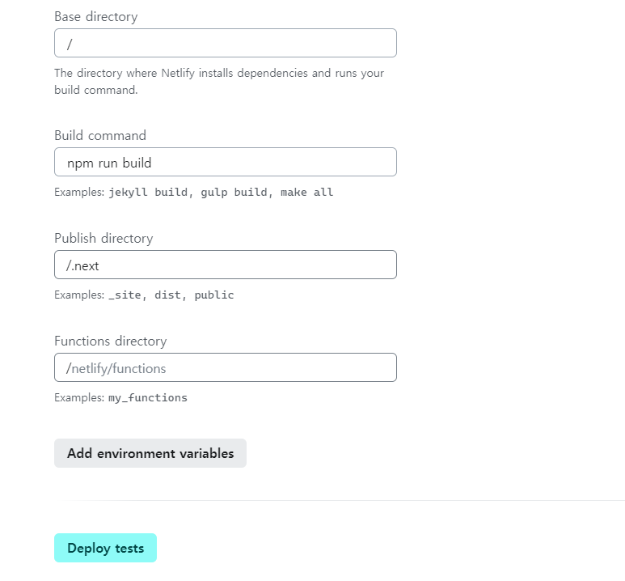
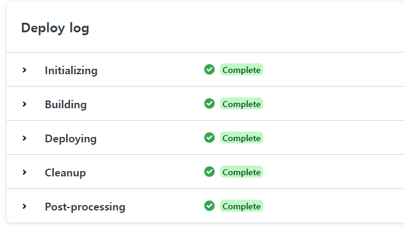
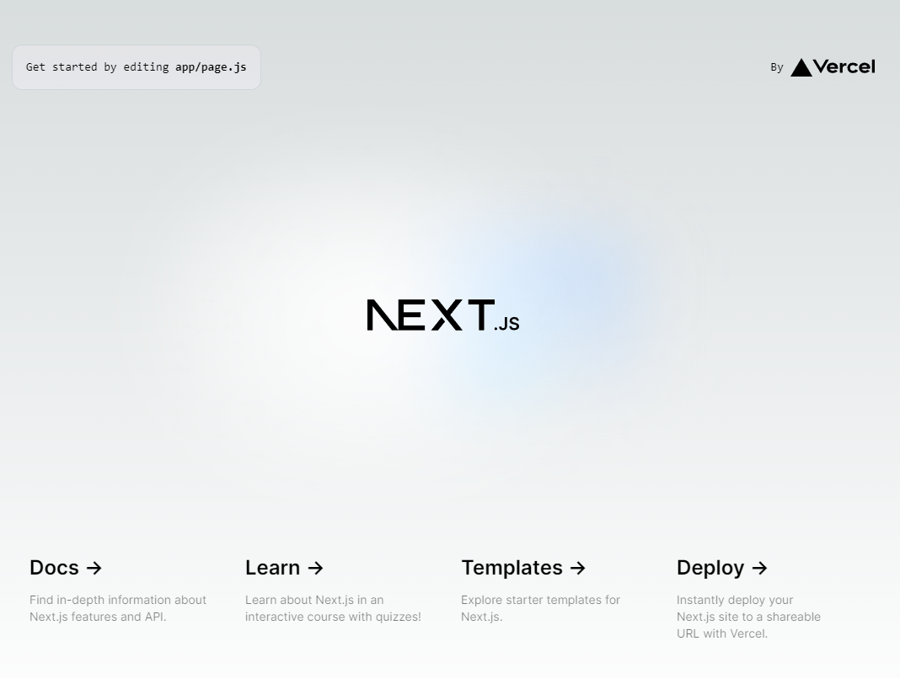
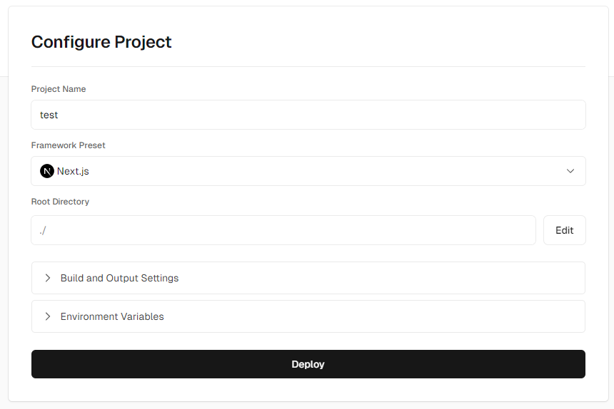
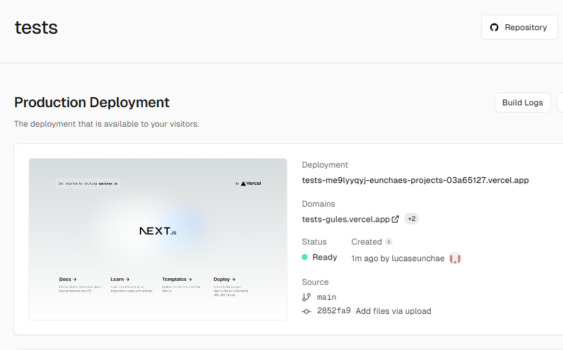

# 9.3 리액트 애플리케이션 배포하기(9.3.1 ~ 9.3.2)

- [9.3 리액트 애플리케이션 배포하기(9.3.1 ~ 9.3.2)](#93-리액트-애플리케이션-배포하기931--932)
  - [무료 플랜 비교](#무료-플랜-비교)
  - [9.3.1 Netlify](#931-netlify)
    - [배포 과정](#배포-과정)
    - [추가 기능](#추가-기능)
  - [9.3.2 Vercel](#932-vercel)
    - [배포 과정](#배포-과정-1)
    - [추가 기능](#추가-기능-1)

## 무료 플랜 비교 

|  | Netlify | Vercel |
| --- | --- | --- |
| 동시 배포 | 1개 | 1개 |
| 빌드 | 월 300분 | 월 6000분 |
| 배포 횟수 제한 | X | 일 100회 |

  

## 9.3.1 Netlify

Next.js 13.5 이후 버전부터는 `[netlify.toml](https://docs.netlify.com/configure-builds/file-based-configuration/)` 파일이 없어도 배포가 가능한 것으로 보인다.

(참고 링크: [https://docs.netlify.com/frameworks/next-js/runtime-v4/overview/](https://docs.netlify.com/frameworks/next-js/runtime-v4/overview/))

 

### 배포 과정

최신 버전의 Next.js를 `create-next-app` 명령어를 통해 만들고, Github Repository에 올린 이후 책과 동일한 과정으로 배포를 진행 했다.

 

### 추가 기능

- **알림 기능**: 배포의 성공, 실패 등 배포와 관련된 정보를 이메일, PR 코멘트, 슬랙 연동 등 다양한 방법으로 확인할 수 있다.
- **도메인 연동**: 외부에서 구매한 도메인과 연결할 수 있다.
- **서비스 통합**: 오류 수집 툴, 검색 도구, 메모리 DB 등 다양한 서비스들이 Netlify에서 API 형태로 제공되어 Netlify에서 배포하면 이를 연계하여 서비스를 간편하게 구축할 수 있다.
- **서버리스 함수**: 무료 플랜 횟수에 맞춰서 서버리스 함수를 호출할 수 있다.
- **Identify**: 인증 관련 기능 제공한다.
- **사용자 초대**: 만들어진 팀에 사용자를 초대해서 팀원들과 같이 Netlify 배포 작업을 관리할 수 있다.

  

## 9.3.2 Vercel

### 배포 과정

따로 추가 설정 없이 Github Repository에서 프로젝트를 가져온 후 `Deploy`  버튼만 누르면 간단하게 배포할 수 있다.

 

### 추가 기능

- **알림 기능**
- **도메인 연결**
- **서버리스 함수:** Netlify와 다르게 Vercel은 Next.js의 `pages/api`  혹은 `app/api` 의 api를 서버리스 함수로 구분한다.
- **다양한 템플릿**: 블로그, 쇼핑몰 등 코드없이 구축할 수 있는 다양한 템플릿을 제공한다.
