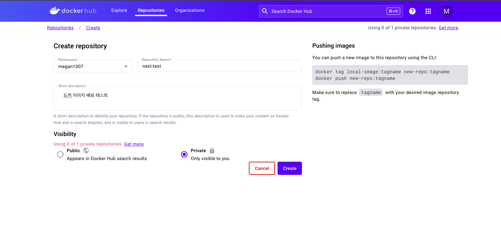
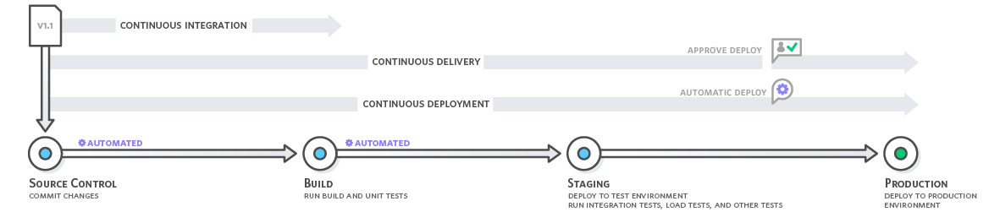

# 도커 이미지 도커 허브에 업로드 하기

- 도커 허브: 도커 이미지를 업로드 해서 다른 사람들과 공유할 수 있는 공간(npm같은 공간)

1. 도커 허브에 저장소를 생성한다
   

2. 도커 허브에 이미지 푸쉬하기

- 이미지를 푸시하려면 이미지의 태그명이 사용자명/저장소명:태그명과 같은 형식으로 일치해야 한다
- 해당 형식에 맞게 태그 생성

```
docker tag next:test megan1007/next-test:next-test
```

도커 데스크톱에서 이미지를 push to hub를 눌러서 배포한다


3. 완료
   

<br>
<br>
<br>

# 도커 이미지 GCP에 업로드하고 실행하기

GCP 무료 크레딧을 사용할 예정이기 때문에 gcloud cli를 설치해야 한다
https://cloud.google.com/sdk/docs/install-sdk?hl=ko

### Google Cloud Registry에 이미지 푸시

- Artifact Registry를 검색해서 들어간 다음 저장소를 생성한다.
- 형식은 도커를 선택해서 만들면 된다


- 위의 사진의 복사 아이콘을 선택해서 저장소 주소를 복사한 다음, 이미지를 푸쉬한다.
- 먼저 이미지를 푸쉬하기 전에 docker CLI가 gcloud에 대한 인증 정보를 갖게끔 설정한다.

  ```
  gcloud auth configure-docker 저장소 주소(복사한 값에서 프로젝트 아이디와 저장소명 제외한 것)
  ```


<br>

- 이미지 태그를 다시 달고
  

<br>

- 복사한 저장소에 푸쉬
  

- 저장소에 푸쉬 완료(나중에 이미지 하나 더 푸쉬해서 2개 됨)
  

<br>
<br>

### Cloud Run에서 이미지 실행

: 푸쉬된 이미지를 클라우드 환경에서 실행할 수 있도록 도와주는 서비스

- Cloud Run에 접속해서 서비스 만들기
  

- 기존 컨테이너 이미지에서 버전 1개 배포를 클릭해서 이전에 업로드한 이미지를 선택한다.
  

- 도커 이미지에서 3000번 포트로 열어뒀으므로 3000번 포트를 설정해서 이미지를 만든다.

애플 실리콘(m1, m2)를 사용하는 경우, 이미지 플랫폼이 달라서 배포에 실패하기 때문에  
도커 이미지 플랫폼을 변경해서 빌드한다.

```
docker build --platform linux/amd64 -t next:test
```

또는 cloud build를 사용해서 업로드 할 수도 있다

https://cloud.google.com/run/docs/building/containers?hl=ko#builder

## 깃허브 레포와 Cloud Run을 사용한 CI/CD

CI - 지속적 통합: 자동화된 빌드 및 테스트가 수행된 후, 개발자가 코드 변경 사항을 중앙 리포지토리에 정기적으로 병합하는 개발 방식
CD - 지속적 배포: 프로덕션에 릴리스하기 위한 코드 변경이 자동으로 준비되는 소프트웨어 개발 방식



- Cloud Run에서 새로운 서비스를 만들면서 소스 저장소에서 지속적으로 새버전 배포 옵션을 선택한다
- 깃허브와 연동시킨 다음 배포하고자 하는 레포지토리를 선택한다.
- github에 도커 이미지를 올려놓은 저장소가 없어서 이미지를 따로 캡쳐하지 않았습니다.


- 어떤 분기를 CI/CD 할지 입력하고
- 도커 파일의 소스 위치를 입력해줍니다.
- 해당 설정을 마무리하면 CI/CD준비가 완료됩니다.
- 분기를 main으로 설정했다면, main 브랜치가 업데이트 될 때마다 자동적으로 빌드와 배포가 이뤄집니다.

## 정리

1. 대부분의 기업에서는 애플리케이션을 도커라이즈해서 배포하고, 히스토리를 남겨두거나 롤백하는 등의 용도로 도커를 사용하고 있다.
2. 따라서 프론트엔드 개발자도 애플리케이션을 도커라이즈 하는 방법을 숙지하고 있어야 한다.
3. 쿠버네티스를 활용해서 컨테이너 기반 애플리케이션을 탄력적으로 배포하고 관리할 수 있다.
4. GCP외에도 AWS, Azure 등을 사용해서 배포할 수 있다.
