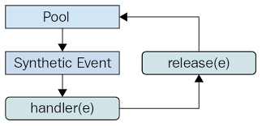

## 10.1.3 import React from ‘react’ 가 더 이상 필요 없다: 새로운 JSX transform

JSX는 브라우저가 이해할 수 있는 코드가 아니다. 따라서 바벨이나 타입스크립트를 활용하여 JSX를 일반적인 자바스크립트로 변환하는 과정이 필요하다. 

- 16 버전까지는 JSX를 아래와 같이 변환하여 `import React from ‘react’`가 반드시 필요했다.

```jsx
const Component = (
  <div>
    <span>hello world</span>
  </div>
);
//리액트 16에서의 변환
var Component = React.createElement(
  'div',
  nu11,
  React.createElement('span', null, 'hello world'),
);
```

`React.createElement`를 수행할 때 `import React from ‘react’`가 필요하다.

- 리액트 17부터는 바벨과 협력하여 import 구문 없이도 JSX를 변환할 수 있게 됐다.
    - 번들링 크기를 줄일 수 있어졌다.

```jsx
'use strict'

var _jsxRuntime = require('react/jsx-runtime')

var Component = (0, _jsxRuntime.jsx)('div’, {
	children: (0, _jsxRuntime.jsx)('span', {
		children: 'hello world',
	}),
})
```

JSX 요소를 `React.createElemen`t로 변환하는 작업이 `react/jsx-runtime`모듈에서 수행된다.

해당 모듈은 JSX 코드를 실행하는 데 필요한 런타임 함수들을 포함하고 있다.

이 모듈을 사용하면 JSX 코드가 변환되는 동안 **`React`**가 직접적으로 참조되지 않아도 되므로, **`import React from 'react'`**를 작성하지 않아도 된다.

따라서 **`react/jsx-runtime`** 모듈을 불러오는 **`require`** 구문을 사용하여 JSX를 변환하는 동안 필요한 런타임 함수들을 제공할 수 있다. 이렇게 하면 코드량을 줄이고 불필요한 React 모듈의 로드를 피할 수 있다.

## 10.1.4 그 밖의 주요 변경 사항

### **이벤트 풀링 제거**

- 리액트에는 이벤트를 처리하기 위하여 브라우저의 기본 이벤트를 한번 더 감싼 SyntheticEvent라는 이벤트가 있다.
- 리액트는 이러한 이벤트를 한번 래핑한 이벤트를 사용하기 때문에 이벤트가 발생할 때 마다 이벤트를 새로 만들어야 했다.
- 이렇게 SyntheticEvent 풀을 만들어서 이벤트가 발생할 때마다 가져오는 것을 **이벤트 풀링**이라고 한다.

**이벤트 풀링 : React에서 이벤트 핸들러가 호출될 때 생성되는 이벤트 객체의 재사용 메커니즘**

1. 이벤트 핸들러가 이벤트를 발생시킨다. 
2. 합성 이벤트 풀에서 합성 이벤트 객체에 대한 참조를 가져온다. 
3. 이 이벤트 정보를 합성 이벤트 객체에 넣어준다. 
4. 유저가 지정한 이벤트 리스너가 실행된다. 
5. 이벤트 객체가 초기화되고 다시 이벤트 풀로 돌아간다. 



**이벤트 풀링 문제점**

```jsx

export default function App()
{
    const [value, setValue] = useState('')
    function handleChange(e: ChangeEvent<HTMLInputElement>){
        e.persist()
        setValue(() => {
            return e.target.value
        })
    }

    return <input onChange={handleChange} value = {value} />
}
```

- 이벤츠 풀링 방식을 통해 서로 다른 이벤트 간에 이벤트 객체를 재사용하고, 이 재사용하는 사이에 모든 이벤트 필드를 null로 변경한다.
- 한번 이벤트 핸들러를 호출한 SyntheticEvent는 이후 재소용을 위해 null로 초기화된다.
- 비동기 코드 내부에서 SyntheticEvent 인 e에 접근하면 이미 사용되고 초기화된 이후이기 떄문에 null만 얻게 된다.
- 따라서 비동기 코드 내부에서 이 합성 이벤트 e에 접근하기 위해서는**`e.persist()`**같은 처리가 꼭 필요했다.

<br>

✅ **`e.persist()`**

1. **이벤트 객체의 유지**: **`e.persist()`**를 호출하면 React에게 SyntheticEvent 객체를 유지하도록 지시한다. 이렇게 하면 이벤트 객체가 재사용되지 않고 계속해서 유효한 상태를 유지한다.
2. **비동기 코드 내에서의 접근**: 예를 들어, 이벤트 핸들러 내부에서 비동기 작업을 수행하는 경우가 있다. 이때 이벤트 객체가 사용된 후에 비동기 작업이 완료될 때까지 객체가 유지되어야 한다. 그렇기 때문에 **`e.persist()`**를 호출하여 객체를 유지하고 나중에 비동기 코드에서도 접근할 수 있도록 한다.

<br>

**이벤트 폴링의 삭제**

- 비동기 코드로 이벤트 핸들러에 접근하기 위해서 위처럼 별도 메모리 공간에 합성 이벤트 객체를 할당해야만 했다.
- 모던 브라우저에서는 이와 같은 방식이 성능 향상에 도움이 되지 않는다.


> ✅ 이러한 이유로 React 17부터는 이벤트 풀링이 기본적으로 비활성화되었다. 
대신에 React는 이벤트 핸들러 호출 시에 항상 새로운 SyntheticEvent 객체를 생성하여 사용한다. 이렇게 함으로써 브라우저 간의 일관된 동작을 보장하고, 이벤트 핸들러 외부에서의 SyntheticEvent 객체에 접근이 가능하도록 한다.
> 

```jsx
export default function App() {
const [value, setValue] = useState('');

function handleChange(e) {
    setValue(e.target.value);
}

return <input onChange={handleChange} value={value} />;
}
```

1. **`e.persist()`** 호출이 제거.  React 17 이후부터는 더 이상 필요하지 않다.
2. **`handleChange`** 함수의 매개변수 `e` 의 타입이 명시적으로 지정되지 않는다. React 17 이후부터는 TypeScript 사용 시에도 이벤트 객체의 타입을 명시할 필요가 없다. 단순히 `e`의 타입은 `ChangeEvent<HTMLInputElement>`가 아니라 `ChangeEvent`로 처리된다.

<br>

---

### useEffect 클린업 함수의 비동기 실행

❗**useEffect의 클린업 함수는 16 버전까지 동기적으로 처리되었다.**

- 클린업 함수가 완료되기 전까지는 다른 작업을 방해하여 불필요한 성능 저하로 이어졌다.

✅ **17 버전부터는 화면이 완전히 업데이트된 이후에 클린업 함수가 비동기적으로 실행된다.**

- 클린업 함수는 컴포넌트의 커밋 단계가 완료될 때까지 지연된다.
- 화면이 업데이트가 완전히 끝난 이후에 실행 되므로 성능적 이점을 볼 수 있다.

<br>

---

### 컴포넌트의 undefined 반환에 대한 일관적인 처리

리액트 16, 17버전은 의도치 않게 잘못된 반환으로 발생하는 실수를 방지하기 위해, 컴포넌트 내부에서 undefined를 반환하면 오류가 발생한다. 

 ❗ **그러나 리액트 16에서는 forwardRef나 memo에서 undefined 를 반환하면 별다른 에러가 발생하지 않는 문제가 있었다.**

**✅ 17버전부터는 이러한 forwardRef나 memo에서의 undefined에러가 정상적으로 발생한다.** 

- 참고로 18에서는 undefined를 반환하는 것이 허용되었다.