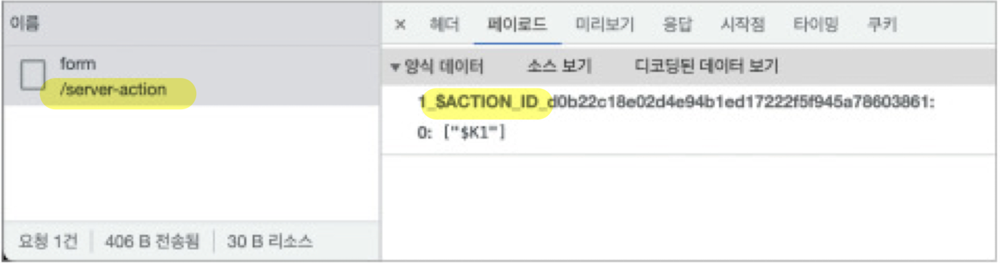
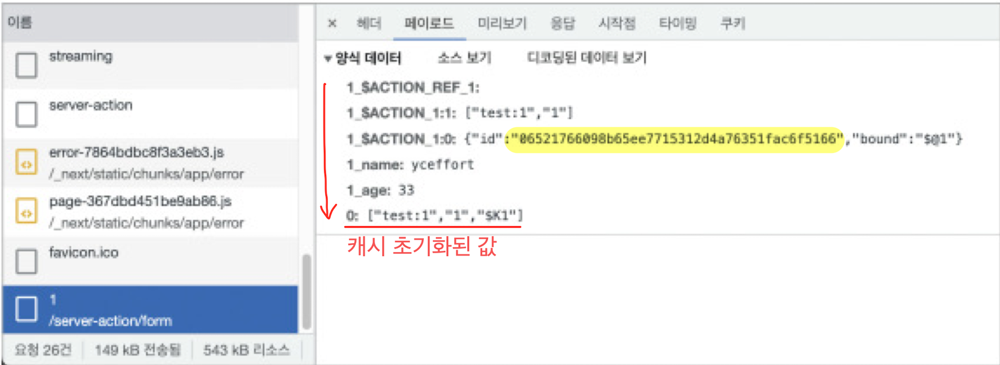

# 11장.  Next.js 13과 리액트 18

## 11.4. 웹팩의 대항마, 터보팩의 등장(beta)

- 터보팩
    - 웹팩 대비 700배, Vite 대비 최대 10배 빠르다
    - 현재는 개발모드에서만 제한적으로 사용 가능
    - 버그가 발생할 수도 있고 이를 최적화하는데 시간 필요 → 적극 적용하기에는 시기상조!

---

## 11.5. 서버 액션(alpha)

- API를 생성하는 것이 아니라 함수 수준에서 서버에 직접 접근해 데이터 요청 등을 수행할 수 있는 기능
- 서버 액션 사용을 위한 세팅 ( ⇒ Next.js 14버전 부터는 기본 세팅에 포함되어 있음 )
    - next.config.js
        
        ```jsx
        /** @type {import('next') .NextConfig} */
        const nextConfig = {
        	experimental: {
        		serverActions: true,
        	},
        }
        
        module.exports = nextConfig
        ```
        
- 서버 액션 생성 방법
    1. **함수 내부 또는 파일 상단에 “use server” 지시자 선언**
    2. **서버에서 실행할 함수는 반드시 async → async가 아니면 에러 발생**

### 11.5.1.  form의 action

- 예시 코드
    
    ```jsx
    export default function Page() {
      async function handleSubmit() {
        'use server'
    
        console.log('해당 작업은 서버에서 수행합니다. 따라서 CORS 이슈가 없습니다.')
    
        const response = await fetch('https://jsonplaceholder.typicode.com/posts', {
          method: 'post',
          body: JSON.stringify({
            title: 'foo',
            body: 'bar',
            userId: 1,
          }),
          headers: {
            'Content-type': 'application/json; charset=UTF-8',
          },
        })
    
        const result = await response.json()
        console.log(result)
      }
      return (
    	  <form action = {handleSubmit}>
    		  <button type = "submit">form 요청 보내보기</button>
    		 </form>
      )
     }
    ```
    
- 실행 결과
        
    
        
- 예시 코드가 서버에서 빌드된 코드
    
    ```jsx
    // .next/server/app/server-action/form/page.js
    
    // 해당 페이지에서 수행하는 서버 액션을 모아둔다.
    const actions = {
    	// 앞서 페이로드에서 본 액션 아이디를 확인할 수 있다.
    	dOb22c1802d494bled17222f5f945a78603861: () =>
    		Promise.resolve(/* import eager */)
    			.then (__webpack_require_.bind(__webpack_require_, 5948))
    			.then ((mod) => mod['$$ACTION_®']),
    }
    // ...
    
    // 해당 페이지
    function Page() {
    	async function handleSubmit() {
    		return $$ACTION_0(handleSubmit.$$bound)
    	}
    // ...
    }
    
    //...
    async function $$ACTION_0(closure) {
    	console. Log('해당 작업은 서버에서 수행합니다. 따라서 CORS 이슈가 없습니다. ')
    	const response = await fetch('https://jsonplaceholder.typicode.com/posts', t
    	method: 'post',
    		body: JSON.stringify({
    			title: 'foo', 
    			body: 'bar'
    			userld: 1,
    		}),
    		headers: {
    			'Content-type': 'application/json; charset=UTF-8',
    		},
    	})
    	const result = await response. json()
    	console.log(result)
    }
    ```
    
    - 클라이언트 코드에서는 현재 코드의 라우트 주소 ACIOINT_ID값만 서버에 보낸다.
    - 서버에서는 요청받은 라우트 주소와 ACTION_ID를 바탕으로 실행할 코드를 찾고 서버에서 직접 실행한다.
    - 빌드 시점에 “use server” 키워드를 확인하고 클라이언트 코드에서 서버에서 작업할 코드를 미리 분리하여 서버에서만 실행되는 서버액션으로 만든것이다.

---

- form과 실제 노출하는 데이터가 연동되어있는 경우 예시 코드
    
    ```jsx
    import kv from '@vercel/kv'
    
    import { revalidatePath } from 'next/cache'
    
    interface Data {
    	name: string
    	age: number
    }
    
    export default async function Page({ params }: { params: { id: string } }) {
    	const key = 'test:${params.id}'
    	const data = await kv.get<Data>(key)
    	
    	async function handleSubmit(formData: FormData) {
    	'use server'
    	
    	const name = formData.get('name')
    	const age = formData.get('age')
    	
    	await kv.set(key, {
    		name,
    		age,
    	})
    	
    	revalidatePath('/server-action/form/${params.id}')
    	｝
    
    	return (
    		<>
    			<h1>form with data</h1>
    			<h2>
    				서버에 저장된 정보: {data?.name} {data?.age}
    			</h2>
    			
    			<form action={handleSubmit)>
    				<label htmlFor="name"> 이름: </label>
    				<input
    					type="text"
    					id="name" 
    					name="name" 
    					defaultValue={data?.name)
    					placeholder="이름을 입력해 주세요."
    				/>
    				
    				<label htmlFor="age"> 나이: </label>
    				<input
    					type="number"
    					id="age" 
    					name="age"
    					defaultValue={data?.age}
    					placeholder="나이를 입력해 주세요."
    				/>
    				
    				<button type="submit">submit</button>
    			</form>
    		</>
    	)
    }
    ```
    
- 실행 결과
    
    
    
    - form 태그에 서버 액션인 handleSubmit 추가하여 formData를 기반으로 데이터를 가져와 다시 데이터베이스인 kv에 업데이트
    - 업데이트가 성공했다면 revalidatePath를 통해 해당 주소의 캐시 데이터를 갱신하여 컴포넌트를 재랜더링하게 했다.
        - Next.js의 **server mutation**
            1. redirect : 특정 주소로 리다이렉트
            2. revalidatePath : 해당 주소의 캐시를 즉시 업데이트
            3. revalidateTag : 여러 다양한 fetch 요청을 특정 태그 값으로 구분 가능하며 특정 태그가 추가된 fetch 요청을 모두 초기화
                
                ```jsx
                // 사용 예시
                fetch('https://localhost:8080/api/something', { next: { tags: [''] } })
                ```
                

---

- PHP 같은 전통적인 서버 기반 웹 애플리케이션과 크게 다를 바 없어 보일수 있다.


> ⭐ **하지만 서버 액션을 통한 모든 과정은 페이지 새로고침 없이 수행된다는 것이다.**

- 작동 원리 세부 설명
    
    “최초에 페이지를 서버에서 렌더링한 이후에 서버에 데이터 수정을 요청하는 것, 그리고 수정된 결과를 다시 조회하여 리렌더링하는 일련의 과정”이 **모두 페이지 새로고침 없이 데이터 스트링으로 이루어진다!**
    
- 서버 액션의 장점
    - form을 서버액션과 함께 사용하면 데이터 추가 및 수정 요청을 좀 더 자연스럽게 수행할 수 있다.
    - Next.js에서 관리하는 캐시를 효과적으로 초기화할 수 있기에 사용자에게 더욱 자연스러운 사용자 경험을 안겨줄 수 있다.
    - 좋은 실습 영상 : [애플코딩 - Next.js의 Server actions 기능](https://codingapple.com/unit/nextjs-server-actions/)

### 11.5.2.  input의 submit과 image의 formAction

- input type=”submit” 또는 input type=”image”의 formAction prop으로도 서버 액션을 추가하여 사용할 수 있습니다. (방식은 예제코드와 동일)

### 11.5.3.  startTransition과의 연동

- 예제 코드
    
    ```jsx
    // server-action/index.ts
    'use server'
    import kv from '@vercel/kv'
    import { revalidatePath } from 'next/cache'
    
    export async function updateData(
    	id: string,
    	data: { name: string; age: number },
    ) {
    	const key = 'test:$(id)'
    	await kv. set(key, {
    		name: data.name,
    		age: data.age,
    	})
    	
    revalidatePath('/server-action/form/${id}')
    }
    
    // client-component. tsx
    'use client'
    import { useCallback, useTransition} from 'react'
    import { updateData } from '../../server-action' 
    import { SkeletonBtn } from '../../app/styles/styled-components/components'
    
    export function ClientButtonComponent({ id}: { id: string }) {
    	const [isPending, startTransition] = useTransition()
    	const handleClick = useCallback(() => {
    		startTransition(()=> updateData(id, {name: '기본값', age: 0 }))
    		}, [])
    		
    	return isPending ? (
     		<SkeletonBtn/>
    	) : (
    		<button onclick={handleCLick}>기본값으로 돌리기</button>
    	)
    }
    ```
    
    - startTransition : useTransition의 두번째 배열요소
    - startTransition과 서버액션을 같이 사용하면 얻는 장점
        - 이전과 동일한 로직을 구현하면서도 page 단위의 loading.jsx를 사용하지 않아도 된다.
        - isPending을 통해 페이지 전체가 아니라 컴포넌트 부분(버튼만)만 로딩 처리 가능
### [서버액션 테스트 사이트]
- 코드가 바로 실행되어있어 바로 확인해볼 수 있는 사이트가 있길래 첨부합니다!<br>
링크 : https://react-deep-dive-example-six.vercel.app/server-action/form

### 11.5.4. server mutation이 없는 작업

- 새로고침하여 변화가 적용된 화면을 사용자에게 보여줄 필요가 없는 경우라면 
바로 이벤트 핸들러에 넣어도 된다.

### 11.5.5. 서버 액션 사용 시 주의할 점

- 서버 액션을 'use client'가 선언돼 있는 컴포넌트 내에서 사 용할 경우 에러가 발생한다.
    - 서버 액션은 클라이언트 컴포넌트 내에서 정의될 수 없다.
    - 클라이언트 컴포넌트에서 서버 액션을 쓰고 싶을 때는 앞의 startTransition 예제처럼
    'use server"로 서버 액션만 모여 있는 파일을 별도로 import해야 한다.
- 서버 액션을 props 형태로 클라이언트 컴포넌트에 넘기는 것 또한 가능하다.
    - 서버에서만 실행될 수 있는 자원은 반드시 파일 단위로 분리하여 사용해야 한다.

---

## 11.6. 그 밖의 변화

- 프로젝트 전체 라우트에서 사용할 수 있는 미들웨어 강화
- 더욱 간단해진 SEO 작성 기능
- 정적 내부 링크 분석 기능

---

## 11.7. Next.js 13 코드 맛보기

### 11.7.1. getServerSideProps와 비슷한 서버 사이드 렌더링 구현해 보기

- 예제코드
    
    ```jsx
    import { fetchPostById } from '#services/server'
    
    export default async function Page({ params }: { params: { id: string } }) {
      const data = await fetchPostById(params.id, { cache: 'no-cache' })
    
      return (
        <div className="space-y-4">
          <h1 className="text-2xl font-medium text-gray-100">{data.title}</h1>
          <p className="font-medium text-gray-400">{data.body}</p>
        </div>
      )
    }
    ```
    
    - **getServerSideProps를 사용하면**
        
        ⇒ 서버에서 미리 만들어진 정보를 바탕으로 클라이언트에서 하이드레이션 수행
        
        ⇒ 클라이언트 요청마다 전체 페이지가 렌더링되어 페이지의 전체 데이터 전송
        
    - **리액트 18을 사용하면**
        
        ⇒ 서버 컴포넌트에서 렌더링한 결과를 직렬화 가능한 데이터로 클라이언트에게 제공
        
        ⇒ 컴포넌트별로 직렬화된 데이터를 제공하기에 개별적인 데이터 관리가 가능하고 불필요한 데이터 전송 감소