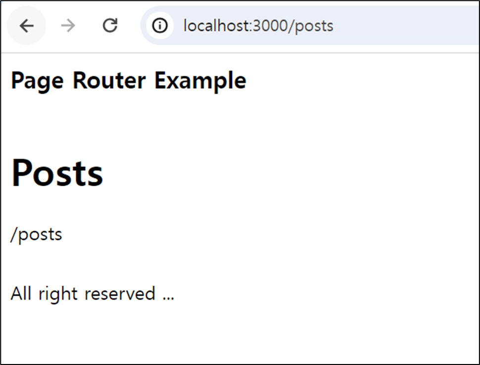
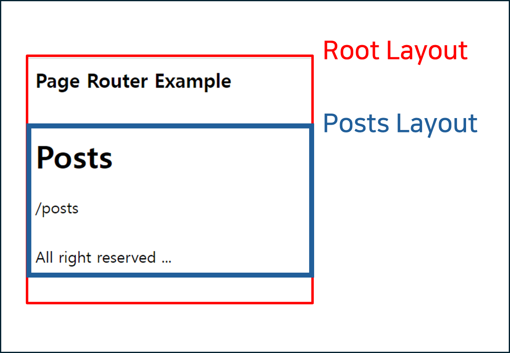

# 11. Next.js 13과 리액트 18(11.1 ~ 11.2.1)

- [11. Next.js 13과 리액트 18(11.1 ~ 11.2.1)](#11-nextjs-13과-리액트-18111--1121)
  - [Next.js 13버전의 특징](#nextjs-13버전의-특징)
  - [11.1 app 디렉터리의 등장](#111-app-디렉터리의-등장)
    - [레이아웃 적용 방식의 변경](#레이아웃-적용-방식의-변경)
    - [라우팅 적용 방식의 변경](#라우팅-적용-방식의-변경)
    - [layout](#layout)
    - [page](#page)
    - [error](#error)
    - [non-found](#non-found)
    - [loading](#loading)
    - [route.js](#routejs)
  - [11.2 리액트 서버 컴포넌트](#112-리액트-서버-컴포넌트)
    - [11.2.1 기존 리액트 컴포넌트와 서버 사이드 렌더링의 한계](#1121-기존-리액트-컴포넌트와-서버-사이드-렌더링의-한계)
    - [자바스크립트 번들 크기가 0인 컴포넌트를 만들 수 없다.](#자바스크립트-번들-크기가-0인-컴포넌트를-만들-수-없다)
    - [백엔드 리소스에 대한 직접적인 접근이 불가능하다.](#백엔드-리소스에-대한-직접적인-접근이-불가능하다)
    - [자동 코드 분할(Code Splitting)이 불가능하다.](#자동-코드-분할code-splitting이-불가능하다)
    - [연쇄적으로 발생하는 클라이언트와 서버의 요청을 대응하기 어렵다.](#연쇄적으로-발생하는-클라이언트와-서버의-요청을-대응하기-어렵다)
    - [추상화에 드는 비용이 증가한다.](#추상화에-드는-비용이-증가한다)
    - [결론](#결론)
  - [참고 자료](#참고-자료)

## Next.js 13버전의 특징

- SSR 구조에 많은 변화가 있는 리액트18 버전 채택
- 레이아웃을 본격적으로 지원
- Turbopack 출시

<br><br>

## 11.1 app 디렉터리의 등장

### 레이아웃 적용 방식의 변경

**Page Router에서의 레이아웃 적용 방식**

- components
  - **layout.tsx**
  - **posts-layout.tsx**
- pages
  - posts
    - index.tsx
  - \_app.tsx
  - \_document.tsx

```jsx
// _document.tsx

import { Html, Head, Main, NextScript } from "next/document";

export default function Document() {
  return (
    <Html lang="en">
      <Head />
      <body>
        <Main />
        <NextScript />
      </body>
    </Html>
  );
}
```

```jsx
// _app.tsx

import Layout from "@/components/layout";
import type { AppProps } from "next/app";

export default function App({ Component, pageProps }: AppProps) {
  const getLayout = Component.getLayout ?? ((page) => <Layout>{page}</Layout>);

  return getLayout(<Component {...pageProps} />);
}
```

```jsx
// posts/index.tsx

import PostsLayout from "@/components/posts-layout";
import Layout from "@/components/layout";

export default function Page() {
  return <>/posts</>;
}

Page.getLayout = function getLayout(page) {
  return (
    <Layout>
      <PostsLayout>{page}</PostsLayout>
    </Layout>
  );
};
```





**App Router에서의 레이아웃 적용 방식**

- app
  - posts
    - **layout.tsx**
    - page.tsx
  - **layout.tsx**

```jsx
// posts/page.tsx

export default function Posts() {
  return <>/posts</>;
}
```

<br><br>

### 라우팅 적용 방식의 변경

- **Page Router**: `pages/a/b.tsx` 와 `pages/a/b/index.tsx` 모두 “/a/b” 주소로 변환
- **App Router**: `app/a/b/page.tsx` 만 “/a/b” 주소로 변환됨. App Router에서는 파일명이 주소에 영향을 끼치지 않음.

<br><br>

### layout

**Root Layout**

```jsx
// app/layout.tsx

import Footer from "@/components/footer";
import Navbar from "@/components/navbar";
import type { Metadata } from "next";

export const metadata: Metadata = {
  title: "Create Next App",
  description: "Generated by create next app",
};

export default function RootLayout({
  children,
}: Readonly<{
  children: React.ReactNode,
}>) {
  return (
    <html lang="en">
      <body>
        <Navbar />
        <main>{children}</main>
        <Footer />
      </body>
    </html>
  );
}
```

모든 페이지에 영향을 미치는 공통 레이아웃이다. 웹 페이지를 만드는데 필수적인 `<html>` , `<head>` 등의 태그가 전부 포함되어 있고, Page Router에서의 `_app.tsx` 와 `_document.tsx` 이 Root Layout 하나로 대체될 수 있다.

**Nested Layout**

```jsx
// app/posts/layout.tsx

export default function PostsLayout({
  children,
}: {
  children: React.ReactNode,
}) {
  return (
    <>
      <h1>Posts</h1>
      <section>{children}</section>
    </>
  );
}
```

“/posts” 로 시작되는 url에만 적용되는 중첩 레이아웃으로, `app/XXX/layout.tsx` 같은 위치에 추가할 수 있다.

**주의 사항**

- 파일명 `layout` 은 예약어이다.
- `children` 을 prop으로 받아서 렌더링 해야 한다.
- `layout` 파일 내부에는 `export default` 내보내기가 존재해야 한다.
- `layout` 내부에서도 API요청과 같은 비동기 작업을 수행할 수 있다.

<br><br>

### page

페이지 컴포넌트에 해당된다.

**parameters**

- **params**: `[…id]`와 같은 동적 라우트 파라미터를 사용할 경우 해당 값이 들어온다.
- **searchParams**: “/posts?search=hello” 은 `{search: "hello"}` 와 같은 값이 들어온다.

**주의 사항**

- `export default` 내보내기가 존재해야 한다.
- `layout` 과 마찬가지로 `page` 도 예약어이다.

<br><br>

### error

해당 라우팅 영역에서 사용되는 공통 에러 컴포넌트이다. 특정 라우팅 별로 서로 다른 에러 UI를 렌더링할 수 있다.

```jsx
// app/error.tsx

export default function Error({ error }) {
  return (
    <>
      <div>
        <strong>Error: </strong> {error?.message}
      </div>
    </>
  );
}
```

- `layout` 에서 발생하는 에러는 상위 컴포넌트의 `error` 에서 처리된다.

<br><br>

### non-found

`app/not-fount.tsx` 를 생성하면 404 Not Fount 에러가 발생했을 경우 해당 컴포넌트를 렌더링 한다.

<br><br>

### loading

뒤에서 나올 `Suspense` 를 기반으로 해당 컴포넌트가 불러오는 중임을 나타낼 때 사용할 수 있다.

```jsx
export default function Loading() {
  return "Loading...";
}
```

<br><br>

### route.js

`app/my-api/routes.ts` 와 같이 정의하면 “/my-api” 에 해당되는 Next 자체 API를 만들 수 있다.

```jsx
// api/my-api/routes.ts

import { NextRequest } from 'next/server'

export async function GET(request): {}
export async function POST(request): {}
export async function PUT(request): {}
export async function DELETE(request): {}
...
```

- `routes` 는 예약어이다.
- `routes` 가 존재하는 디렉터리에는 `page` 가 존재할 수 없다.

<br><br><br>

## 11.2 리액트 서버 컴포넌트

리액트 18에서 새롭게 도입된 서버 컴포넌트는 서버 사이드 렌더링과는 완전히 다른 개념이다.

<br>

### 11.2.1 기존 리액트 컴포넌트와 서버 사이드 렌더링의 한계

### 자바스크립트 번들 크기가 0인 컴포넌트를 만들 수 없다.

클라이언트(브라우저) 측에서 외부 라이브러리를 실행해야 할 경우가 많다. 이는 사용자 기기의 부담으로 존재하고, 외부 라이브러리를 사용하면 번들 사이즈가 커지므로 렌더링도 지연되게 된다.

→ 서버에서 외부 라이브러리를 실행하고 결과물만 클라이언트에 제공하면 어떨까?

<br>

### 백엔드 리소스에 대한 직접적인 접근이 불가능하다.

```jsx
import db from "db";

async function Board({ id }) {
  const text = await db.board.get(id);
  return <>{text}</>;
}
```

기존 리액트 컴포넌트에서는 위와 같이 DB에 직접 접근해서 원하는 데이터를 가져올 수 없다. 대신 REST API를 사용해서 데이터에 접근하는 방식을 사용한다.

→ 클라이언트 측에서 직접 DB에 접근해서 데이터를 가져올 수 있다면 어떨까?

<br>

### 자동 코드 분할(Code Splitting)이 불가능하다.

```jsx
import { lazy } from "react";

const OldPhotoRenderer = lazy(() => import("./OldPhotoRenderer.tsx"));
const NewPhotoRenderer = lazy(() => import("./NewPhotoRenderer.tsx"));

function Photo(props) {
  if (isNew) {
    return <NewPhotoRenderer />;
  } else {
    return <OldPhotoRenderer />;
  }
}
```

기존 리액트 컴포넌트는 위와 같이 `lazy` 를 이용해서 컴포넌트를 사용할 때 소스를 지연 로딩 할 수 있다. 하지만 이는 개발자가 `lazy` 로 감싼 컴포넌트를 일일이 기억해야 하는 단점이 있다.

→ 만약 이 코드 분할을 서버에서 자동으로 수행해주면 어떨까?

<br>

### 연쇄적으로 발생하는 클라이언트와 서버의 요청을 대응하기 어렵다.

- A
  - B
  - C
- D

위와 같은 컴포넌트 구조가 있을 때, `D` 는 `B` 에 의해서 렌더링 된다고 가정하자.

부모 컴포넌트인 `A` 의 렌더링이 전부 끝나지 않으면, `B`에 의해 `D` 가 렌더링 준비가 끝났다고 하더라도 `D` 는 `A` 의 렌더링이 끝날 때 까지 `Loading...` 과 같은 상태로 불필요하게 남아있을 것이다.

→ 이러한 작업을 서버에서 전부 수행해서 결과물만 클라이언트로 보여주면 어떨까?

<br>

### 추상화에 드는 비용이 증가한다.

→ 복잡한 추상화에 따른 결과물을 연산하는 작업을 서버에서 수행하면 어떨까? 클라이언트에서 작업을 수행하지 않아도 되므로 속도가 빨라질 것이고, 클라이언트측에 전달되는 결과물 또한 간단해질 것이다. 코드 추상화에 따른 비용은 서버에서만 지불하면 된다.

<br>

### 결론

위와 같은 문제점들을 해결하기 위해 `PHP` , `JSP` 와 같은 완전한 정적인 방식의 SSR을 사용하면 된다. 하지만 그러면 리액트와 같이 클라이언트측에 다양한 경험을 안겨줄수는 없다.

그리고 리액트의 `SSR`과 `CSR` 또한 이 문제를 해결하기에는 조금씩 아쉬움이 있다. 이를 위해 등장한 개념이 `리액트 서버 컴포넌트` 이다.

<br><br>

## 참고 자료

- [Next.js Page Router Layout](https://nextjs.org/docs/pages/building-your-application/routing/pages-and-layouts#layout-pattern)
- [Next.js App Router Layout](https://nextjs.org/docs/app/building-your-application/routing/pages-and-layouts)
