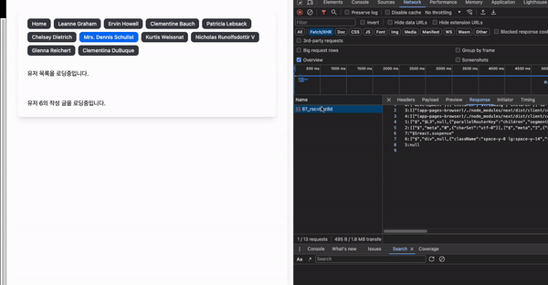

# 11.7.2 getStaticProps와 비슷한 정적인 페이지 렌더링 구현해보기

Next13 이전: getStaticProps 또는 getStaticPaths를 사용해서 정적으로 페이지를 생성  
Next13: generateStaticParams와 fetch의 cache 옵션을 사용해서 정적으로 페이지 생성 가능

```tsx
import { fetchPostById } from '#services/server';

// /app/ssg/[id]에서 [id]로 사용 가능한 값을 전달
export async function generateStaticParams() {
  return [{ id: '1' }, { id: '2' }, { id: '3' }, { id: '4' }];
}

export default async function Page({ params }: { params: { id: string } }) {
  //Next에서 사용하는 fetch는 force-cache가 기본값
  //force-cache: 캐시가 존재하면 해당 값 반환, 없으면 서버에서 데이터를 불러옴(default)
  //no-store: 캐시를 절대 사용하지 않고, 매 요청마다 새롭게 값을 불러옴
  const data = await fetchPostById(params.id);

  return (
    <div className='space-y-4'>
      <h1 className='text-2xl font-medium text-gray-100'>{data.title}</h1>
      <p className='font-medium text-gray-400'>{data.body}</p>
    </div>
  );
}
```

generateStaticParams와 fetch의 기본 캐시 옵션을 사용하면 정적으로 페이지가 생성된다.

<br>

## 더 나아가서, 빌드된 정적 페이지를 점진적으로 갱신해보기

**ISR**: Incremental Static Regeneration  
처음에는 미리 빌드해 둔 페이지를 렌더링해서 내려주고, 캐시 유효시간이 지난 후에는 서버에서 페이지를 다시 생성해서 내려주는 것.

```tsx
import { fetchPostById } from '#services/server';

export const dynamicParams = true;

//해당 옵션을 추가해서 캐시 유효시간을 설정할 수 있다.
export const revalidate = 60; // 60초 동안 페이지 캐시 유효

export async function generateStaticParams() {
  return [{ id: '1' }, { id: '2' }, { id: '3' }, { id: '4' }];
}

export default async function Page({ params }: { params: { id: string } }) {
  const data = await fetchPostById(params.id);

  console.log(`generate page ${params.id}`);

  return (
    <div className='space-y-4'>
      <div className='self-start whitespace-nowrap rounded-lg bg-gray-700 px-3 py-1 text-sm font-medium tabular-nums text-gray-100'>
        마지막 렌더링 시간 (프로덕션 모드만 확인 가능): UTC 서버에서 빌드되는
        시점
        {new Date().toLocaleTimeString()}
      </div>
      <h1 className='text-2xl font-medium text-gray-100'>{data.title}</h1>
      <p className='font-medium text-gray-400'>{data.body}</p>
    </div>
  );
}
```

<br>
<br>
<br>

# 11.7.3 로딩, 스트리밍, 서스펜스

### Suspense와 Streaming을 활용해서 렌더링 중인 컴포넌트 나타내기

### Loading

우선은 Next에서는 loading 파일 예약어를 지원하기 때문에 라우팅별로 로딩 상태를 나타낼 수 있다.

  
위와 같이 라우팅 폴더 안에 loading.tsx 파일을 만들어서 사용할 수 있다.

### Suspense

Suspense를 사용하면 컴포넌트별 로딩 상태를 보여줄 수 있다.

```tsx
import { Suspense } from 'react';

import { PostByUserId, Users } from './components';

export default async function Page({ params }: { params: { id: string } }) {
  return (
    <div className='space-y-8 lg:space-y-14'>
      <Suspense fallback={<div>유저 목록을 로딩중입니다.</div>}>
        {/* 타입스크립트에서 Promise 컴포넌트에 대해 에러를 내기 때문에 임시 처리 */}
        {/* @ts-expect-error Async Server Component */}
        <Users />
      </Suspense>

      <Suspense
        fallback={<div>유저 {params.id}의 작성 글을 로딩중입니다.</div>}>
        {/* @ts-expect-error Async Server Component */}
        <PostByUserId userId={params.id} />
      </Suspense>
    </div>
  );
}
```

```tsx
import { sleep } from '#lib/utils';
import { fetchPosts, fetchUsers } from '#services/server';

export async function Users() {
  console.log('user');
  // Suspense를 보기 위해 강제로 지연시킵니다.
  await sleep(3 * 1000);
  const users = await fetchUsers();

  return (
    <ul>
      {users.map((user) => (
        <li key={user.id}>{user.name}</li>
      ))}
    </ul>
  );
}

export async function PostByUserId({ userId }: { userId: string }) {
  console.log('post');
  await sleep(5 * 1000);
  const allPosts = await fetchPosts();
  const posts = allPosts.filter((post) => post.userId === parseInt(userId, 10));

  return (
    <ul>
      {posts.map((post) => (
        <li key={post.id}>{post.title}</li>
      ))}
    </ul>
  );
}
```

Suspense를 사용하면 컴포넌트들을 비동기적으로 렌더링할 수 있다.  
서버 컴포넌트에서는 서버에 있는 데이터를 async/await로 접근 가능하기 때문에 컴포넌트 자체가 async할 수 있다.  
서버 컴포넌트에서 데이터를 fetch하고 컴포넌트를 리턴하기 전까지 Suspense의 fallback 컴포넌트를 보여주게 된다.

<br>

서버 컴포넌트의 정보는 스트리밍으로 받게 되는데 네트워크 탭을 확인해보면 페이지 렌더링에 소요된 시간만큼 네트워크 요청이 발생한 것을 알 수 있다.  
response를 확인해보면 서버 컴포넌트가 렌더링될 때 응답값의 내용이 늘어남을 확인 할 수 있다.



# 11.8 정리 및 주의사항

- 서버 컴포넌트는 새로운 패러다임으로, 리액트 생태계에 많은 변화를 가져올 것
- 서버 컴포넌트는 파일 단위로 서버와 클라이언트 컴포넌트를 명확히 구분해야 한다.
- 라이브러리 또한 경계에 맞춰서 사용해야 하기 때문에 초기 개발 구조 설계에 큰 혼동이 있을 수 있다.
- Next 공식 문서를 꼭 정독하고, 13버전 이전 사용자의 경우는 마이그레이션 가이드를 읽어볼 것을 권함
