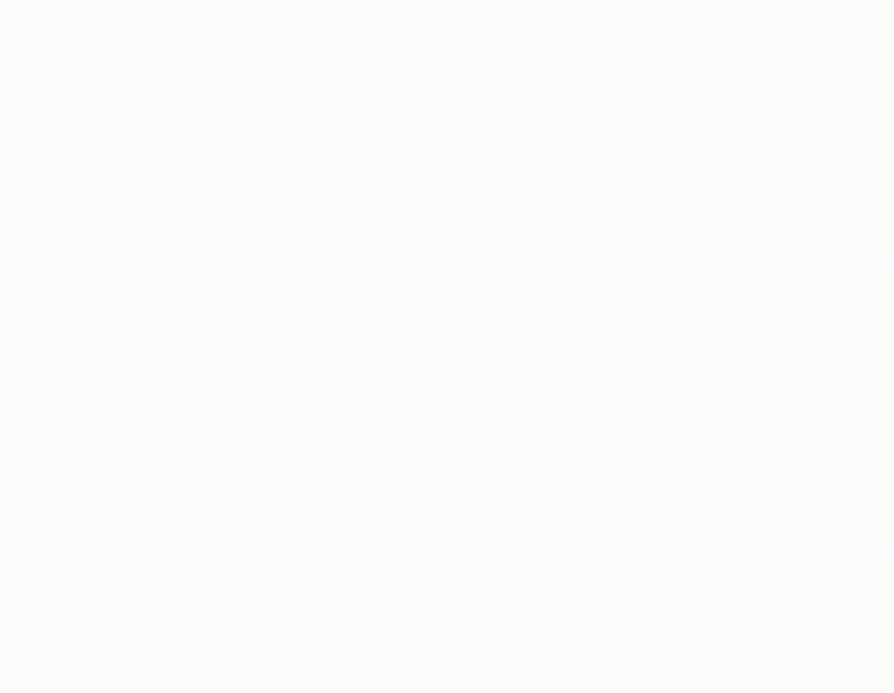
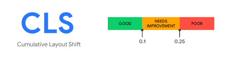

# 12.4 최초 입력 지연`FID`

## 12.4.5 개선 방안

최초 입력 지연을 개선하려면 최초 입력 지연에 가장 큰 영향을 미치는 메인 스레드에 이벤트를 실행할 여유를 줘야 한다. 

### 실행에 오래 걸리는 긴 작업을 분리

- 메인 스레드를 오래 점유하는 긴 작업 (long task)는 FID 뿐만 아니라 서비스 전체에 악영향을 끼친다.

    - 크롬 개발자도구 성능 탭, cpu와 네트워크 속도 감속 이용해보기
    
    .png)
    
    .png)
    
    - 위 방법으로 테스트를 해도 오래 걸리는 작업이라면 서버쪽으로 옮겨서 처리하는 방안 고려해보기

    - 긴 작업을 여러 개로 분리하기

    - 실행이 오래 걸릴 것 같은 작업을 분리, 웹페이지 최초 로딩에 필요하지 않은 내용을 나중에 불러오기 (리액트의 Suspense나 lazy, Next.js의 dynamic을 이용)
    

### 자바스크립트 코드 최소화

- 크롬 개발자도구 커버리지를 통해서 사용되지 않는 코드를 확인할 수 있다. 당장 급하지 않은 코드들은 지연 로딩이나 우선순위를 낮춰서 불러오는 것이 좋다.

- 폴리필(polyfill)을 넣기 전에는 반드시 폴리필이 필요한 환경인지, 폴리필이 아닌 저수준의 자바스크립트 코드로 구현 해도 될지 확인해봐야한다.

### 타사 자바스크립트 코드 실행의 자연

- Google Analytics나 Firebase와 같이 웹페이지의 통계 집계를 위해 제3자가 만든 타사 스크립트를 넣는 경우가 많다.

- 이런 코드로 인해 메인 스레드가 잠시 점유되고 안 좋은 사용성을 제공한다면 주객전도되는 상황을 맞이할 수 있다.

- 주요 자원이 아닌 스크립트는 `<script>`의 `async`와 `defer`를 이용해 지연 불러오기를 하는 것이 좋다.

    - `defer`: 해당 스크립트를 병렬로 다운로드한다. 페이지가 완전히 로딩된 이후 맨 마지막에 실행된다.

    - `async`: 해당 스크립트를 병렬로 다운로드하지만, 다운로드가 완료되면 바로 실행한다. 따라서 `async` 리소스의 실행 순서는 다운로드가 완료된 순서대로 실행된다.

    - 둘 다 없는 경우: `script`를 만나는 순간 다운로드가 우선되며, 다운로드가 완료되면 코드 실행이 우선된다. 다른 작업은 다운로드와 실행이 끝날 때까지 미뤄진다.

- 스크립트는 `async`, `defer`로 갈수록 실행은 뒤로 미뤄지지만 성능은 좋아진다.

- **따라서 타사 스크립트는 가능하면 `async`, 더 가능하다면 `defer` 를 사용하는 것이 성능상 좋다.**

- 광고와 같이 특정 뷰포트 위치에 따라 불러와야 하는 컴포넌트라면 `Intersection Observer`를 이용해 뷰포트에 들어오는 시점에 불어오는 것이 좋다.

<br>
<br>


# 12.5 누적 레이아웃 이동`CLS`

## 12.5.1 정의

- 누적 레이아웃 이동 *(Cumulative Layout Shift)*
- 페이지의 생명주기 동안 발생하는 **모든 예기치 않은 이동에 대한 지표를 계산**하는 것이다.

    


    

## 12.5.2 의미

- CLS는 **뷰포트 내부 요소에 대해서만 측정**한다.
- 최초 렌더링이 시작된 위치에서 만약 레이아웃의 이동이 발생한다면 CLS 점수로 기록되게 된다.

- 단순히 요소가 추가되는 것은 문제 없지만, 그 요소가 다른 요소의 시작 위치에 영향을 미친다면 CLS로 간주 된다.

- **사용자 액션으로 인한 CLS는 점수에 포함되지 않는다.**


## **12.5.3 예제**

- 뷰포트의 높이가 작을수록 약간은 유리한 점수를 얻을 수 있다.

- 스켈레톤 UI의 활용으로 누적 레이아웃 지표에 도움을 줄 수 있다.

## **12.5.4 기준 점수**




```layout shift score = impact fraction * distance fraction```

- `CLS` **최종 점수** = **영향분율** (레이아웃 이동이 발생한 요소의 전체 높이와 뷰포트 높이의 비율) X **거리분율** (레이아웃 이동이 발생한 요소가 뷰포트 대비 얼마나 이동했는가)

- CLS는 0.1 이하의 경우 좋음, 0.25 이하의 경우 보통, 그 외에는 개선이 필요한 나쁜 점수로 보고된다.

## **12.5.5 개선 방안**

### 삽입이 예상되는 요소를 위한 추가적인 공간 확보

- `useEffect` 내부에서 뷰포트 내에 노출될 확률이 높은 작업을 최소화 해야한다.

- `useEffect` 사용이 불가피하다면 `useLayoutEffect` 훅 사용을 검토볼 수 있다.

- 스켈레톤 UI의 사례처럼, 동적으로 뜰 것으로 예상되는 지점에 공간을 미리 확보해두는 것도 좋은 방법이다.

- 가장 좋은 방법은 서버 사이드 렌더링

- 서버에서 동적 요소 유무를 미리 판단해서 클라이언트에 HTML를 제공해준다면 깔끔하게 처리할 수 있다.

### 폰트 로딩 최적화

- 폰트로 인한 문제는 크게 두 가지이다.

    - FOUT(flash of unstyled text): HTML 문서에서 지정한 폰트가 보이지 않고 대체 기본 폰트로 있다가 뒤늦게 폰트가 적용되는 현상

    - FOIT(flash of invisible text): HTML 문서에서 지정한 폰트가 보이지 않고, 기본 폰트가 없거나 별도의 설정으로 텍스트가 없는 채로 있다가 뒤늦게 폰트가 로딩되면서 페이지에 렌더링되는 현상

- 폰트는 각각 고유의 높이와 너비를 가지고 있기에 폰트마다 레이아웃이 달라져서 누적 레이아웃 이동이 발생할 수 있다.

- 따라서 다음과 같은 옵션을 유념해야 한다.

    - `<link>`의 `preload` 사용

        - `preload`로 지정된 요소는 웹페이지 생명주기에서 초기에 불러와야 하는 주요 리소스로 간주하므로 `rel=preload`로 스타일이나 폰트를 지정하면 페이지의 렌더링을 가로막거나 레이아웃을 방해할 가능성이 줄어든다.

    - `font-family: optional`

        - 폰트를 불러올 수 있는 방법은 크게 다섯 가지로 나뉜다.

        - `auto`(기본값): 브라우저가 폰트를 불러오는 방법을 결정한다.

        - `block`: 폰트가 로딩되기 전까지 렌더링 중단한다.(최대 3초) 웹 폰트의 로딩이 완료되면 비로스 폰트 적용한다.

        - `swap`: 앞서 언급한 FOUT 방식, 폴백 폰트로 렌더링한 다음, 웹 폰트의 로딩이 완료되면 웹 폰트 적용한다.

        - `fallback`: 100ms간 텍스트가 보이지 않고 그 이후에 폴백 폰트로 렌더링한다. 3초 안에 폰트가 로딩된다면 해당 웹 폰트로 전환하고, 그렇지 않으면 폴백 폰트를 계속 사용한다.

        - `optional`: `fallback`과 유사하다. 100ms 동안 보이지 않고 폴백 폰트로 렌더링한다는 점은 동일하나 0.1초 이내로 폰트가 다운로드되지 않거나 캐시되어있지 않다면 해당 폰트를 보여주지 않는다.
        

### 적절한 이미지 크기 설정

.gif)

```jsx
img{
	width: 100%;
	height: auto;
}
```

- 반응형 웹사이트에 최적화 할 수 있는 기법으로, 기기의 너비가 어떻게 되든 원본 이미지의 가로세로 비율이 일정해 사용자에게 최적의 이미지를 보여줄 수 있다.
- 하지만 이미지의 높이를 이미지가 완전히 다운로드 되기 전까지는 알지 못하기 때문에 **누적 레이아웃 이동이 커지는 결과**를 낳는다.


이를 해결하기 위해선❓ 

✅ width와 height를 지정

.gif)

- 이미지를 로딩하기 전에 가로세로 비율을 계산해 이미지가 표시되는 만큼 면적을 할당해둔다. 이는 브라우저의 유저 에이전트 스타일시트(브라우저가 제공하는 스타일)에서 제공하는 `aspect-ratio` 속성 덕분이다.

✅ 만약 반응형 이미지를 사용하고 싶다면 `srcset` 속성을 사용하는 것이 좋다.

```html

```


<br>
<br>
<br>
<br>
<br>
출처 : https://web.dev/articles/cls?hl=ko