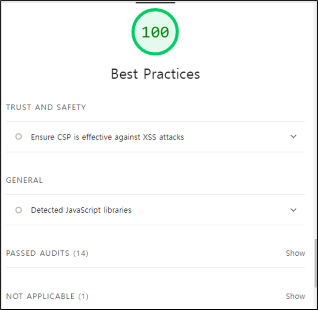

# 13. 웹페이지의 성능을 측정하는 다양한 방법

- [13. 웹페이지의 성능을 측정하는 다양한 방법](#13-웹페이지의-성능을-측정하는-다양한-방법)
  - [13.1 애플리케이션에서 확인하기](#131-애플리케이션에서-확인하기)
    - [13.1.1 create-react-app](#1311-create-react-app)
    - [13.1.2 create-next-app](#1312-create-next-app)
  - [13.2 구글 라이트하우스](#132-구글-라이트하우스)
    - [13.2.1 구글 라이트하우스 - 탐색 모드](#1321-구글-라이트하우스---탐색-모드)

<br>

## 13.1 애플리케이션에서 확인하기

### 13.1.1 create-react-app

```tsx
// reportWebVitals.ts

import { ReportHandler } from "web-vitals";

const reportWebVitals = (onPerfEntry?: ReportHandler) => {
  if (onPerfEntry && onPerfEntry instanceof Function) {
    import("web-vitals").then(({ getCLS, getFID, getFCP, getLCP, getTTFB }) => {
      getCLS(onPerfEntry);
      getFID(onPerfEntry);
      getFCP(onPerfEntry);
      getLCP(onPerfEntry);
      getTTFB(onPerfEntry);
    });
  }
};

export default reportWebVitals;
```

CRA을 통해 만든 리액트엡에 생기는 `reportWebVitals` 는 웹에서 성능을 측정하기 위한 함수이다.

내용을 보면 알 수 있듯이, 누적 레이아웃 이동(CLS), 최초 입력 지연(FID), 최초 콘텐츠풀 페인트(FCP), 최대 콘텐츠 페인팅(LCP), 첫 바이트까지의 시간(TTFB)를 측정하는 용도로 사용된다.

`ReportHandler` 는 성능 객체인 Metric을 인수로 받는 함수이다. 따라서 아래와 같이 console을 통해 성능 데이터를 확인 하거나, 서버로 성능 데이터를 전송할 수 있다.

```jsx
reportWebVitals(console.log); // 성능 관련 데이터를 console을 통해 확인 가능
/*
출력값
[
	{
	  "name": "FCP",
	  "value": 125.3...,
	  ...
	},
	...
]
*/

function sendToAnalytics(metric) {
  const body = JSON.stringify(metric);
  const url = "/api/analytics";
  fetch(url, { body, method: "POST", keepalive: true });
}
reportWebVitals(sendToAnalytics); // 서버로 성능 관련 데이터를 전송
```

### 13.1.2 create-next-app

Next.js에서는 `NextWebVitalsMetric` 을 제공한다. \_app 페이지에 코드를 추가해서 사용해 볼 수 있다.

```tsx
// _app.tsx

import { AppProps, NextWebVitalsMetric } from "next/app";

export function reportWebVitals(metric: NextWebVitalsMetric) {
  console.log(metric);
}

function MyApp({ Component, pageProps }: AppProps) {
  return <Component {...pageProps} />;
}

export default MyApp;
```

예약어로 지정된 함수명 `reportWebVitals` 을 구현해서 성능을 측정할 수 있다.

**CLS, FID, FCP, LCP, TTFB** 말고도 Next.js에서는 CRA와는 다르게 아래의 세가지 Next.js와 관련된 추가적인 지표를 제공한다.

- **Next.js-hydration**: 페이지가 SSR 되어 하이드레이션하는데 걸린 시간
- **Next.js-route-change-to-render**: 페이지가 경로를 변경한 후 페이지를 렌더링 시작하는 데 걸린 시간
- **Next.js-render**: 경로 변경이 완료된 후 페이지를 렌더링하는데 걸린 시간

위의 세가지 지표는 구글에서 주도적으로 만들고 있는 핵심 웹 지표와는 다르게 어느 정도 이하로 지표가 기록돼야 한다는 등의 기준은 없다. 다만 각각의 지표를 살펴보면서 SSR시 오래 걸리진 않는지 등을 확인할 필요가 있다.

<br><br>

## 13.2 구글 라이트하우스

`reportWebVitals`을 통해 지표를 수집하는 방식은 코드 수정이 필요하고, 지표 수집을 위해 사전 준비가 필요하다는 번거로움이 있다. 이에 반해 별도의 코드 수정없이 지표를 수집할 수 있는 방법이 있는데 바로 **구글 라이트하우스**이다.

크롬 개발자 도구의 Lighthouse탭, CLI 등을 통해 구글 라이트하우스를 사용할 수 있는데, CLI는 CI/CD와 같은 제한적인 환경에서 사용하기에 적합하다.

### 13.2.1 구글 라이트하우스 - 탐색 모드


개발자 도구의 Lighthouse 탭에서 탐색 모드(Navigation)이 선택된 상태로 `Analyze` 버튼을 누르면 페이지를 새로 로드하고 페이지의 성능 지표를 수집한다.


몇 초가 지나면 위와 같이 성능이 측정 된 것을 확인할 수 있다.

<br>

**Performance(성능)**


핵심 웹 지표인 FCP, LCP, CLS외에도 **Total Blocking Time,** **Speed Index**의 두가지 추가적인 지표가 있다.

- **Total Blocking Time**: 메인 스레드에서 특정 시간 이상 실행되는 작업. 즉 긴 작업이 수행될 때마다 메인 스레드가 차단된 것으로 간주한다. 브라우저는 이렇게 길게 실행되는 작업 때문에 무언가 다른 작업을 수행할 수 없기 때문이다. 메인 스레드 작업이 50ms 이상 걸리면 이를 긴 작업이라고 간주하고, 이렇게 실행되는 긴 작업을 모아서 **Total Blocking Time**이라고 한다. 각각의 작업에서 50ms를 뺀다음 이를 모두 합해 계산한다. 최초로 사용자에게 보여주는 콘텐츠와 관련된 작업만 대상으로 한다.
- **Speed Index**: 페이지가 로드되는 동안 얼마나 빨리 시각적으로 표시되는지를 계산한다. 3.4초 이내면 좋음, 5.8초 이내면 보통, 그 이후는 느리다고 판단한다.

<br>

**접근성(Accessibility)**


장애인 및 고령자 등 신체적으로 불편한 사람들이 일반적인 사용자와 동등하게 웹페이지를 이용할 수 있도록 보장하는 것을 말한다.

시각장애인이 스크린 리더를 통해 웹페이지를 직접 듣는 경우 이미지에 대한 설명이 필요하고, 청각장애인을 위해 오디오나 비디오는 자막이 필요하기도 하다.

이런 다양한 사용자를 배려하기 위해 HTML과 CSS 등에 적절한 대안을 삽입하는 것을 접근성이라고 한다.

<br>

**권장 사항(Best Practices)**



웹 사이트를 개발할 때 고려해야 할 요소들(보안, 표준 모드, 최신 라이브러리, 소스 맵 등)을 잘 지키고 있는지를 나타내는 지표이다. 그 예로는 XSS 방지, HTTPS 사용 여부, HTML DOCTYPE 존재 여부 등이 있다.

<br>

**검색 엔진 최적화(SEO)**


웹페이지가 구글과 같은 검색엔진이 쉽게 웹페이지 정보를 가져가서 공개할 수 있도록 최적화돼 있는지를 확인하는 것을 의미한다.

단순히 문서를 크롤링하기 쉽게 만들었는지부터 robots.txt가 유효한지, 이미지와 링크에 설명 문자가 존재하는지, `<meta>`나 `<title>`등으로 페이지 정보를 확인할 수 있는지 등을 확인한다.

SEO 점수가 높을수록 검색 엔진 검색결과 우선순위에 높게 나타나 사용자가 유입될 가능성이 높아진다.
