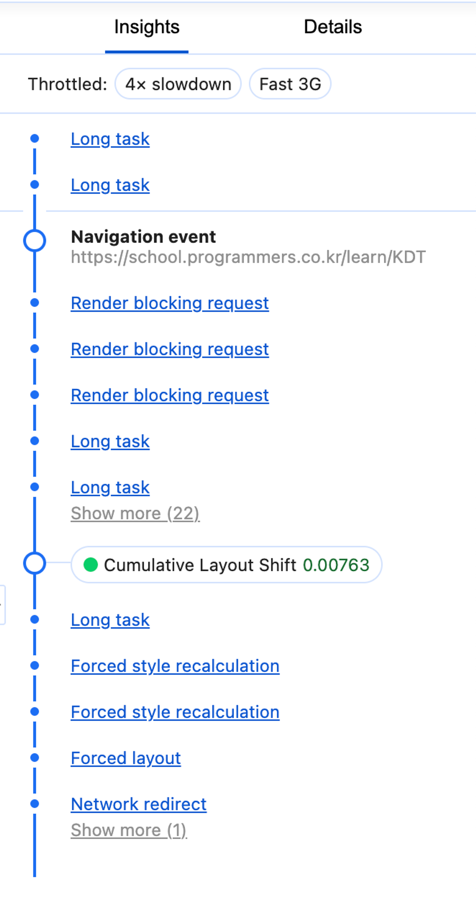
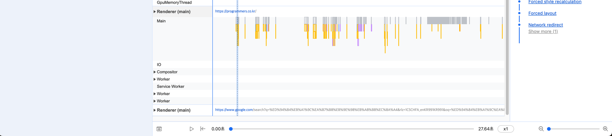

# 13장 웹페이지의 성능을 측정하는 다양한 방법

## 13.3. WebPageTest

### 13.3.7. Content

- 웹사이트에서 제공하는 콘텐츠, 애셋을 종류별로 묶어 확인 가능
- 예시 화면
    
    
    

### 13.3.8. Domains

- Content 메뉴에서 보여준 애셋들이 어느 도메인에서 왔는지를 확인 가능
- 중요 리소스는 웹사이트와 같은 곳에서 요청 할수록 도메인 연결에 소요되는 비용을 줄일 수 있다
- 예시 화면
    
    
    

### 13.3.9. Console Log

- 사용자가 웹페이지에 접속했을 때 console.log로 무엇이 기록됐는지 확인 가능
- 물론 console.log 또한 부하가 발생하기에 가급적이면 사용하지 말아야 한다.
- 디버깅 목적으로 사용한다면 개발자만 제한적으로 볼 수 있게 해야한다.
- 예시 화면
    
    
    

### 13.3.10. Detected Technologies

- 웹사이트를 개발하는데 사용된 기술을 확인할 수 있는 메뉴이다.
- 예시 화면
    
    
    

### 13.3.11. Main-thread Processing (메뉴 이름은 ”Processing”)

- **Processing Breakdown**
    - 메인 스레드가 어떤 작업을 처리했는지 확인 가능 (유휴시간(idle time) 제외)
    - 실제로 어떠한 작업을 하고 있었는지 상세히 확인 가능
        - 작업 종류
            - 스크립트 실행(Scripting)
            - 레이아웃(Layout)
            - 리소스 로딩(Loding)
            - 페인팅(Painting)
            - 기타
    - 예시 화면
        
        
        
- **Timing Breakdown**
    - 유휴시간(idle time)을 포함한 메인 스레드의 작업 확인 가능
    - 예시 화면
        
        
        

### 13.3.12. Lighthouse Repost (현재는 메뉴에 없음)

- 구글 라이트하우스 리포트 확인 가능
- 원격지의 다소 일반적인 모바일 기기의 브라우저에서 측정된다는것 외에는 차이 없음

### 13.3.13. 기타

- **Image Analysis**
    - 해당 사이트에 어떠한 이미지가 있는지 확이니 가능
    - 웹사이트의 이미지들이 최적화된다면 리소스를 어느정도 아낄 수 있는지 확인 가능
- **Request Map**
    - 해당 웹사이트에서 요청이 어떻게 일어나고 있는지에 대해 시각화 도구를 통해 확인 가능
- **Data Cost**
    - 국가별로 가장 저렴한 요금제를 기준으로 해당 웹사이트를 로딩했을 때 발생하는 실제요금 확인 가능
- **Security Score** (현재는 메뉴에 없음)
    - 해당 웹사이트의 보안 취약점 확인 가능

---

## 13.4. 크롬 개발자 도구

- **사용 목적 : 단번에 웹사이트의 문제를 파악하기 어려운 경우에 사용한다.**
    - 개발된 지 오래된 웹사이트, 혹은 개발자와 운영자가 다른 경우
    - 번들만으로 정확한 문제가 짐작되지 않을 경우
- 시크릿 창으로 웹사이트를 여는 것을 추천
    - 각종 크롬 확장 프로그램으로 인해 성능 이슈 파악에 방해될 수 있음

### 13.4.1. 성능 통계 (Performance Insights)

- 제공 기능
    - **Measure Page Load** : 웹사이트 로딩 시작부터 끝까지 확인
    - **Start Recording** : 웹사이트의 원하는 액션을 수행하면서 성능 확인
- **Throttling** : 고의로 네트워크와 CPU 속도를 지연시킬 수 있는 기능
    - 일반적인 사용자의 상대적 환경을 재현하여 테스트해볼 수 있다.
- **사용 방법**
    1. F12 → Performance Insights → Fast 3G / 4x slowdonw (예시) → Start Recording
    2. 녹화되는 동안 테스트할 기능을 웹사이트에서 실행
    3. 녹화 중지
    4. 결과 확인
- 예시 화면
    
    
    

---

### 1️⃣ Insights

- 성능을 측정하는 기간 동안 발생한 이벤트 중에서 중요한 내용을 시간의 흐름대로 보여준다.
- 예시 화면
    
    
    
- 발생하는 이벤트
    - **핵심 웹 지표**
        - 최초 콘텐츠풀 페인트(FCP)
        - 최대 콘텐츠풀 페인트(LCP)
        - DOM Content Loaded
    - **Performance Measure**
        - User Timing API로 측정한 지표 확인 가능
    - **⭐️ Long Task ⭐️**
        - 메인 스레드에서 실행되는 데 오랜 시간으로 분류된 긴 작업을 의미
        - 어떤 함수로 인해 오랜 시간이 걸렸는지 확인 및 실제 코드 확인 가능
        - 예시 화면
            
            
            
    - **Render blocking CSS**
        - 렌더링을 막는 CSS에 대해 확인 가능
        - 예시 화면
            
            
            
    - **Forced Style recalculation**
        - 이미 스타일이 한번 계산된 이후에 어떠한 이유로 스타일이 다시금 계산되는 작업이 강제로 발생했음을 의미
        - 스타일 재계산은 리소스가 많이 소요되므로 유저의 특별한 액션이 없는 이상 최초 로딩 시에는 일어나지 않는 것이 좋음
        - 예시 화면
            
            
            

---

### 2️⃣ 메인 메뉴

- 성능을 측정하는 기간 동안 무슨 일이 일어나는지 확인할 수 있는 다양한 기능 제공
- 예시 화면
    
    
    
    
    
- **제공되는 기능**
    - **페이지의 완성 과정 확인 (파란색 세로선)**
        - 시간대로 페이지가 렌더링되는 모습 확인 가능
    - **Layout Shifts**
        - 레이아웃 이동이 일어난 기록
        - 무엇이 누적 레이아웃 이동을 발생하는지 확인 가능
    - **Network**
        - 성능 측정 기간 동안 발생한 네트워크 요청 확인 가능
    - **Renderer**
        - 렌더러의 작업 내역 확인 가능
        - 크기가 큰 작업 존재 시, Details 탭을 통해 확인 필요 → 성능 개선의 여지가 있다!
    - **Timing**
        - User Timing API와 관련된 기록이 남아있다.
        - 웹사이트의 기능 중에 측정을 원하는 부분이 있다면 아래의 코드를 통해 원하는 부분의 성능을 측정할 수 있다.
        - Timing 코드
            
            ```csharp
            const mark = 'marA'
            window.performance.mark(mark)
            // 측정하고 싶은 작업을 시작
            
            window.performance.measure('여기에 적은 메시지가 Timings에 나타납니다.',mark)
            ```