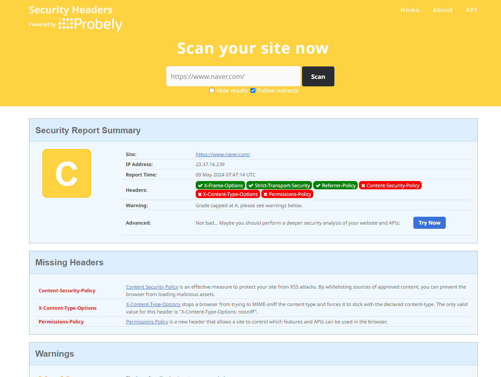
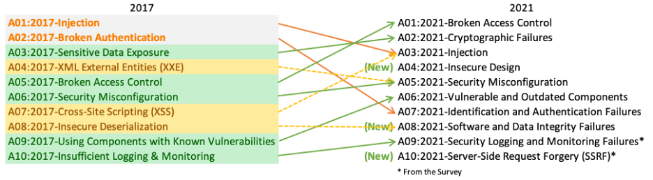

## **14.4.7 Content-Security-Policy**

CSP는 웹 브라우저에서 사용하는 콘텐츠 기반의 보안 정책이다.

콘텐츠 보안 정책은 XSS 공격이나 데이터 삽입 공격과 같은 다양한 보안 위협을 막기 위해 설계됐다.

[디렉티브](https://www.w3.org/TR/CSP2/#directives)
> 1. **`default-src`**: 기본 리소스 출처를 정의한다. 
> 2. **`script-src`**: JavaScript 파일의 출처를 정의한다.
> 3. **`style-src`**: CSS 파일의 출처를 정의한다.
> 4. **`img-src`**: 이미지의 출처를 정의
> 5. **`font-src`**: 폰트 파일의 출처를 정의
> 6. **`connect-src`**: XMLHttpRequests, Web Sockets, 등의 출처를 정의
> 7. **`media-src`**: 미디어 파일의 출처를 정의
> 8. **`object-src`**: **`<object>`**, **`<embed>`**, **`<applet>`**의 출처를 정의
> 9. **`form-action`**: **`<form>`**의 **`action`** 속성에 대한 출처를 정의
> 10. **`frame-ancestors`**: 페이지가 로드될 수 있는 부모 프레임의 출처를 제한한다.
> 11. **`report-uri`** 또는 **`report-to`**: 보안 위반 보고서를 전송할 엔드포인트를 정의한다.
> 12. `form-action`: HTML 요소의 작업으로 사용할 수 있는 URL을 제한한다.  
> 13. **`plugin-types`** : 삽입될 수 있는 리소스 유형을 제한한다. 
> 

Value
> - `*`   : 모든 것을 허용
> - **`none`**: 모든 리소스 출처를 차단한다.
> - **`self`**: 현재 도메인만 허용한다.
> - **`unsafe-inline`**: 소스코드 내 인라인 스크립트 및 스타일을 허용한다.
> - **`unsafe-eval`**: **`eval()`** 및 **`Function()`**을 사용하는 동적 코드 실행을 허용한다.
> - **`<scheme>`**: 지정된 **`scheme`** (예: **`https:`**)을 허용한다.
> - **`<host-source>`**: 지정된 호스트(도메인 또는 IP 주소)를 허용한다.
> - **`data:`**: data URI를 허용한다.
> - **`blob:`**: Blob URI를 허용한다.
>

<br>
사용 예시

**font-src**

```jsx
Content-Security-Policy: font-src <source>;
```

font의 src로 가져올 수 있는 소스를 제한할 수 있다. 선언된 font 이외의 소스는 모두 차단된다.

**form-action**

form-action은 폼 양식으로 제출할 수 있는 URL을 제한할 수 있다.

```jsx
<meta http-equiv="Content-Security-Policy" content="form-action 'none'" />
export default function App() {
	function handleFormAction() {
		alert('form action!')
	}

	return (
		<div>
			<form action={handleFormAction} method="post">
				<input type="text" name="name" value="foo" />
				<input type="submit" id="submit" value="submit" />
			</form>
		</div>
	)
}
```

이 컴포넌트에서 submit을 눌러 form을 제출하면 `form-action` 을 `none`으로 설정하였기 때문에 콘솔에 다음과 같은 에러 메시지가 출력되며 동작하지 않는다.

```powershell
Refused to send form data to ‘****’ because it violates the following Content Security Policy directive: “form-action= ‘none’”.
```
<br>

## **14.4.8 보안 헤더 설정하기**

### Next.js
Next.js에서는 애플리케이션 보안을 위해 HTTP 경로별로 보안 헤더를 적용할 수 있다.

```jsx
const securityHeaders = [
	{
		key: 'key',
		value: 'value',
	}
]

module.exports = {
	async headers() {
		return [
			{
				/* 모든 주소에 설정한다. */
				source: '/:path*',
				headers: securityHeaders
			}
		]
	}
}
```


### NGINX

정적인 파일을 제공하는 NGINX의 경우 다음과 같이 경로별로 add_header지시자를 사용해 원하는 응답헤더를 더 추가할 수 있다.

```jsx
location / {
	# ...
	add_header X-XSS-Protection "1; mode=block";
	add_header Content-security-Policy "default-src 'self'; script-src 'self'; child-src e_m; style-src 'self' example.com; font-src 'self';";
	#...
}
```

<br>

## 14.4.9 보안 헤더 확인하기

[보안 헤더 확인하기](https://securityheaders.com/)


<br>
<br>


## **14.5 취약점이 있는 패키지의 사용을 피하자**

개발자가 package-lock.json의 모든 의존성을 파악하는 것은 아주 어렵다.

패키지들이 버전에 따라 보안 취약점이 존재할 수도, 업데이트 이후에 보안 취약점이 드러나거나 새롭게 나타날 수 있다. 

따라서 깃허브의 Dependabot이 발견한 취약점은 가능한 빠르게 업데이트 조치하도록 해야 한다. 

리액트, Next.js또는 사용중인 상태 관리 라이브러리와 같이 프로젝트를 구성하는 핵심적인 패키지는 버저닝과 패치 수정등을 항상 예의주시 해야한다. 

[라이브러리 취약점 파악](https://security.snyk.io/)

<br>

## 14.6 OWASP Top 10

OWASP (Open Worldwide Application Project)라는 오픈소스 웹 애플리케이션 보안 프로젝트를 의미한다. 

주로 웹에서 발생 가능한 정보 노출, 악성 스크립트, 보안 취약점 등을 연구한다.

또한 추가적으로 10대 웹 애플리케이션 취약점을 공개한다. 이를 OWASP Top 10이라고 한다. 



<br>

**OWASP Top 10**

> **A01: Broken Access Control (취약한 접근제어)**
> 
> 사용자 접근제어가 제대로 인증되지 않을 경우에 발생한다.
> 
> 허용 목록을 기반으로 공용 리소스를 제외하고는 기본적으로 접근을 막고, 접근 제어 정책을 항상 꼼꼼하게 확인해야 한다. 
> 
> **A02: Cryptographic Failures (암호화 오류)**
> 
> 암호화에 실패하거나, 오류가 있는 경우, 혹은 암호화해야 하는 데이터가 암호화되지 않는 등 민감 데이터에 대한 암호화에 실패하는 경우 이 취약점에 해당한다. 
> 
> HTTP를 HRRPS로 강제로 리다이렉트하는 HSTS를 사용하고, 암호화시 암호문이 고정되지 않도록 해야 하며, 신뢰할 수 있는 인증서를 사용하도록 해야 한다. 
> 
> **A03: Injection (인젝션)**
> 
> SQL, OS, XXE, LDAP 인젝션 취약점은 신뢰할 수 없는 데이터가  전달될 때 나타난다. 
> 
> 사용자가 입력하는 데이터는 모두 의심 하며, 바로 사용하지 말고 한 단계 검증을 거쳐 사용해야 한다. 
> 
> **A04: Insecure Design (불안전한 설계)**
> 
> 코드 구현 단계가 아닌 기획 설계 단계에서 발생한 보안 취약점을 의미한다. 
> 
> 설계가 보안 문제가 있다면 개발로 해결할 수 있는 범위가 제한적이기 떄문에 설계와 기획 단계서부터 주의를 기울여야 한다. 
> 
> **A05: Security Misconfiguration (보안 구성 오류)**
> 
> 애플리케이션 설정 시에 잘못된 설정으로 인해 발생하는 취약점을 의미한다. 
> 
> 애플리케이션을 처음 설치할 때 불필요한 계정이나 문서 등을 제거해두고, 적절한 보안 헤더를 미리 설정해 두는 것이 중요하다. 
> 
> **A06: Vulnerable and Outdated Components (취약하고 오래된 요소)**
> 
> 취약점이 있거나 지원이 종료된 소프트웨어를 사용하는 경우 발생하는 취약점이다. 
> 
> 주기적인 점검과 업데이트가 필요하다. 
> 
> **A07: Identification and Authentication Failures (식별 및 인증 오류)**
> 
> 사용자의 신원 확인에 실패하거나 암호 생성 정책이 없는 경우, 무의미한 대입으로 암호를 찾을 수 없는 경우, 인증 및 세션 관리가 잘못되어 유출되는 등의 인증 관련 보안 취약점을 말한다. 
> 
> **A08: Software and Data Integrity Failures (소프트웨어 및 데이터 무결성 오류)** 
> 
> 애플리케이션이 신뢰할 수 없는 소스, 저장소, CDN, 플러그인, 라이브러리에 의존하거나 잘못된 CI/CD 파이프라인을 사용하는 경우에 발생한다. 
> 
> 반드시 무결성 검증 절차를 거쳐서 보안 취약점이 발생하지 않도록 사전에 예방해야 한다. 
> 
> **A09: Security Logging and Monitoring Failures (보안 로깅 및 모니터링 오류)**
> 
> 주요 기능에 대한 적절한 로깅이 추가되어 있지 않거나 로깅 정보가 부족해 사전에 공격을 감지하지 못하는 취약점을 의미한다. 
> 
> 적절한 형식과 보관 주기로 로깅을 수행해야 하며, 이러한 모니터링은 신속하게 대응할 수 있도록 준비를 갖춰야 한다. 
> 
> **A10: Server-Side Request Forgery (SSRF, 서버측 요청 위조)** 
> 
> 서버에서 이뤄지는 요청을 변조해 원래 가야 할 서버가 아닌 공격자가 의도한 서버로 요청이 가게 하거나 또는 위조된 요청을 보내는 취약점을 의미한다. 
> 

<br>

## 14.7 정리

버그가 없는 완벽한 소프트웨어는 없으면 이는 보안 취약점으로 이어질 수 있다. 앞서 살펴본 OWASP TOP 10 처럼, 보안 이슈는 단순히 개발만 잘 한다고 해결되는 것이 아니다. 

보안 이슈는 웹 서비스 생명주기 전체에 걸쳐 발생할 수 있다. 

항상 보안 이슈에 신경쓰며 준비해야 사용자에게 신뢰받는 서비스를 만들 수 있을 것이다!


